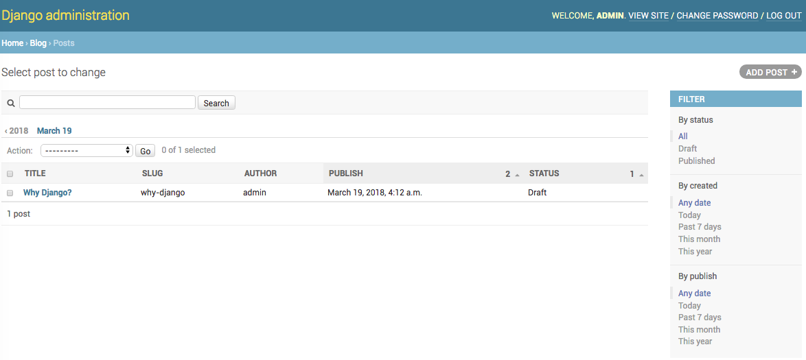
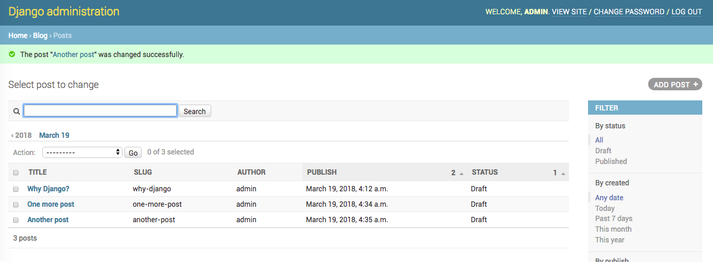

#CH1 创建一个博客应用

我们将在这本书中学习如何创建可以用于生产环境的完整 Django 项目。如果你还没有安装 Django ，那么请在本章第一节学习如何安装。这章介绍如何使用Django创建一个简单的博客应用。本章的目的在于介绍框架如何工作，不同部分如何相互作用及如何通过基本功能创建 django 项目。你将在不过分关注细节的情况下创建一个完整的项目。框架细节将在后续章节进行介绍。

本章涉及以下内容：

- 安装 Django 并创建第一个项目

- 设计模型并生成模型迁移文件

- 为模型创建 administration 网站

- 使用 Queryset 和 manager 工作

- 创建视图、模板和 URLs

- 为 list 视图添加分页

- 使用 Django 类视图

  ​

## 安装 Django

******

如果你已经安装了 Django，可以跳过这一节，直接从下一节（创建第一个项目）开始。作为 Python 库 Django 可以在任何 python 环境中安装。如果你还没有安装 Django，请阅读下面的 Django 安装快速向导。

Django 可用于 Python2.7 和 Python3。本书的例子使用 Python3 。如果你使用 Linux 或 Mac OS X ，很可能已经预先安装了 python 。在 teminal 中输入 python 来确定是否安装了 python 。如果你看到下面的输出，那么 python 已经安装好了。

```python
Python 3.5.0 (v3.5.0:374f501f4567, Sep 12 2015, 11:00:19) 
[GCC 4.2.1 (Apple Inc. build 5666) (dot 3)] on darwin
Type "help", "copyright", "credits" or "license" for more information.
>>>
```

如果你安装的 python 版本低于 3.0 ，或者没有安装 python ，可以从http://www.python.org/download/ 下载Python3.5 并进行安装。

> 笔者注：
>
> 笔者电脑同时安装了 python2.7 和 python3.6。
>
> 在 terminal 输入 python，可以看到下面的输出：
>
> ```
> Python 2.7.10 (default, Oct 23 2015, 19:19:21) 
> [GCC 4.2.1 Compatible Apple LLVM 7.0.0 (clang-700.0.59.5)] on darwin
> Type "help", "copyright", "credits" or "license" for more information.
> \>>> 
> ```
>
> 在 terminal 输入 python3，可以看到下面的输出：
>
> ```
> Python 3.6.4 (v3.6.4:d48ecebad5, Dec 18 2017, 21:07:28) 
> [GCC 4.2.1 (Apple Inc. build 5666) (dot 3)] on darwin
> Type "help", "copyright", "credits" or "license" for more information.
> >>> 
> ```


由于我们将使用 Python3.0 ，因此不需要安装数据库，python 内置 SQLite 数据库，SQLite 是一个可用于 Django 开发的轻量级数据库。如果希望将应用部署到生产环境，那么请使用PostGreSQL、MySQL 或 Oracle 等高级数据库。我们可以从https://docs.djangoproject.com/en/1.8/topics/install/#database-installation.”了解如何在 Django 中使用这些数据库。

> 笔者注：
>
> python2.7也不需要安装数据库。


### 创建独立的 Python 运行环境


推荐使用 virtualenv 创建独立的 Python 运行环境，以便针对不同的项目使用不同版本的 python 库文件，这样做比在系统中安装 Python 库文件更实用。使用 virtualenv 的另一个优点是安装 Python 库文件时不需要管理权限。在 shell 中运行以下命令来安装 virtualenv：

```
pip install virtualenv
```

安装完 virtualenv 后，使用以下命令创建独立的 Python 运行环境：

 ```
virtualenv my_env
 ```

 这个命令将在 Python 环境中创建 my_env 目录，虚拟环境处于激活状态时，安装的所有 Python 库文件都将保存在 my_env/lib/python3.X/site-packages 目录下。

如果系统自带 Python 2.X ，我们又额外安装了 Python 3.X，我们需要告诉虚拟环境使用后者。这时通过下面的步骤创建虚拟环境：

在terminal 中通过以下命令获取 python3 的路径：

```
which python3
```

​ 这里得到的结果是：

```
/usr/local/bin/python3
```

使用以下命令创建独立的 Python 运行环境：

```
virtualenv my_env -p /usr/local/bin/python3
```
运行以下命令激活虚拟环境：

```
source my_env/bin/active
```

shell 提示将使用括号包含激活的虚拟环境，看起来是这样的：

```
(my_env)latop:~ user_name$
```


我们可以在任何时间使用 deactivate 命令关闭虚拟环境。

我们可以从 https://virtualenv.python/io/en/latest/ 找到更多虚拟环境的信息。

我们可以使用 virtualenvwrapper 来管理虚拟环境。这个工具可以可以帮助我们快速创建和管理虚拟环境，我们可以根据 http://virtualenvwrapper.readthedocs.io/en/latest/ 的介绍安装virtualenvwrapper 。

> 笔者注：
>
> 笔者习惯使用 Pycharm ，因此直接通过 Pycharm 创建虚拟环境，创建方法为：
> 通过 pycharm 的偏好设置-Project Interpreter 进行设置：
>
> 
>
> 点击右侧 Create VirtualEnv 创建虚拟环境。创建完成后，项目即可使用虚拟环境了。
>


### 使用 pip 安装 Django

推荐使用 pip 安装 Django， Python3.5 预装了 pip，我们也可以从 https://pip.pypa.io/en/stable/installing/ 找到 pip 的安装说明，在 shell 中运行以下命令安装 Django：

```
pip install Django==1.11 
```

> 笔者注：
>
> ==1.11 表示安装Django 1.11，这里如果不指定版本号，会安装 python 版本能够满足的最新版本。
>


Django 现在已经安装在虚拟环境的 site-packages/ 目录下了。

现在检查一下 Django 是否成功安装了，在 terminal 中运行 python3 并导入 Django 来检查它的版本：

```
>>> import django
>>> django.VERSION
(1, 11, 0, 'final', 1)
```


如果可以看到输出，则表示我们已经成功安装了 Django。

我们也可以使用其它方法安装 Django ，https://docs.djangoproject.com/en/1.11/topics/install/ 有详细的安装说明。


## 创建第一个项目

我们的第一个项目将完成一个博客网站。Django 提供了创建项目文件结构的命令，在shell中运行以下命令：

```python
django-admin startproject mysite	
```

这个命令将创建一个名为 mysite 的 Django 项目。让我们来看一下项目的结构：


这些文件的作用是：

- manage.py：与项目进行交互的命令行工具。它是 django-admin.py 工具的轻量级封装，我们不需要编辑这个文件。
- mysite/：项目目录包含以下文件：
  - `__init__.py`: 空白文件，表示将 mysite 文件夹当做一个模块进行处理；
  - `settings.py`：设置及配置项目。包括初始化缺省设置；
  - `urls.py`：保存 URL 模式。这里的每个 url 都与一个视图相匹配。
  - `wsgi.py`: 项目作为 WSGI 应用运行时的配置。

生成的 settings.py 文件是项目的基本配置（包含使用 SQLite 数据库及默认安装的 Django 应用）。我们需要在数据库中为初始应用创建数据库表。

打开 shell ，跳转到项目的根目录并运行以下命令：

```python
cd mysite
python manage.py migrate
```

将会输出以下内容：

```python
Operations to perform:
  Apply all migrations: admin, auth, contenttypes, sessions
Running migrations:
  Applying contenttypes.0001_initial... OK
  Applying auth.0001_initial... OK
  Applying admin.0001_initial... OK
  Applying admin.0002_logentry_remove_auto_add... OK
  Applying contenttypes.0002_remove_content_type_name... OK
  Applying auth.0002_alter_permission_name_max_length... OK
  Applying auth.0003_alter_user_email_max_length... OK
  Applying auth.0004_alter_user_username_opts... OK
  Applying auth.0005_alter_user_last_login_null... OK
  Applying auth.0006_require_contenttypes_0002... OK
  Applying auth.0007_alter_validators_add_error_messages... OK
  Applying auth.0008_alter_user_username_max_length... OK
  Applying sessions.0001_initial... OK
```

项目初始应用的数据库表已经建好了，我们对 migrate 命令有了初步了解。

### 运行开发服务器

Django 内置一个快速运行代码的轻量级 web服务器，这样可以节约配置生产服务器的时间。Django 服务器运行期间会自动监测代码的变化并自动重载代码。但是，它无法识别向项目中添加文件的操作，这种情况下需要手动重启服务器。

打开 shell 并跳转到项目的根目录，运行以下命令来启动开发服务器：

```python
python manage.py runserver
```

你见看到以下输出：

```python
Performing system checks...

System check identified no issues (0 silenced).
October 24, 2017 - 04:48:13
Django version 1.11.6, using settings 'mysite.settings'
Starting development server at http://127.0.0.1:8000/
Quit the server with CONTROL-C.
```

现在在浏览器中打开 URL ：http://127.0.0.1:8000/，你将看到一个告诉你项目成功运行的页面，类似这样：


可以设置 django 开发服务器在自定义主机和端口运行，或者告诉它载入其它的 setting 文件，例如，可以这样运行 manage.py 命令：

```python
python manage.py runserver 127.0.0.1:8001 --settings=mysite.settings
```

这样可以手动处理需要不同配置的多个环境。需要牢记的是，开发服务器只适用于开发，但是并不适合生产。部署生产环境应该使用 Apache、Gunicorn、uWSGI 等 web服务器以 WSGI 应用的形式运行。使用不同 web服务器部署 django 的详细文档链接为：https://docs.djangoproject.com/en/1.11/howto/deployment/wsgi/。

此外，可以下载本书的第十三章，它将介绍如何为 Django 项目生成生产环境。

### 项目设置

打开 setting.py 文件来看一下项目配置。Django 在这个文件中进行了一些配置，但这只是一部分配置，我们可以从以下链接查看所有可用配置及其默认值：https://docs.djangoproject.com/en/1.11/ref/settings/。

下面的设置需要格外注意：

-  DEBUG ：打开/关闭项目调试模式的布尔值。如果设置为 True ，当捕捉到异常时 Django 将显示详细错误信息。项目部署到生产环境时，要将其设为 False 。不要在生产环境中打开 DEBUG ，否则将可能暴露项目敏感信息。
-  ALLOW_HOST :  DEBUG 模式或者运行测试下不使用该设置。一旦将网站迁移到生产环境并将 DEBUG 设置为 False ，则需要在该设置中添加域名/主机来使用 Django 网站。
- INSTALLED_APPS ：所有项目都需要编辑的设置，Django 从这个设置中读取处于激活状态的应用。默认情况下，Django 包含以下应用：
  - django.contrib.admin:  administration 网站；
  - django.contrib.auth:  权限框架；
  - django.contrib.contenttypes:  内容框架；
  - django.contrib.sessions:  会话框架；
  - django.contrib.messages: 消息框架；
  - django.contrib.staticfiles:  静态文件管理框架；
- MIDDLEWARE_CLASSSES：需要执行的中间件元组。
- ROOT_URLCONF ：定义项目应用的主 URL 模式的 Python 模块。
- DATABASES：设置项目使用的所有数据库的字典。必须设置一个 default 数据库。默认使用 SQLite3 数据库。
- LANGUAGE_CODE: 定义 Django 网站默认使用的语言。

如果你不理解这些内容，不用担心。我们会通过下面的章节熟悉这些设置。


### 项目和应用


本书将会不断的涉及项目和应用这两个术语。 Django 中，项目是指具有一些设置的 Django 安装文件；应用是模型、视图、模板和 URLs 的组合。应用与框架交互来提供一些特定功能，并可以在不同项目中重用。我们把项目当作网站，它可以包括几个应用，如博客、wiki、论坛等，这些应用也可以用在其它项目中。


### 创建一个应用


现在我们来创建第一个 Django 应用。我们将从创建一个博客应用开始。在 terminal 中跳转到项目的根目录并运行以下命令：

```python
python manage.py startapp blog
```

它将创建应用的基本结构，看起来是这样的：


这些文件包括：

- admin.py：该文件用于将模型注册到 administration 网站。

- migrations: 这个目录将包含应用的数据库迁移记录。它允许 Django 追踪模型变化并进行相应的数据库同步。

- models.py： 应用的数据库模型，所有的 Django 应用都要有一个 models.py 文件，但这个文件可以是空的。

- tests.py：该文件用于添加引用的测试程序。

- views.py：该文件实现应用逻辑。每个 view 接收一个 HTTP请求，对其进行处理并返回一个响应。

  ​

## 设计 blog 数据模式


我们将从为 blog 定义初始数据模型开始。每个模型都是 django.db.models.Model 的子类，它的每个属性都表示数据库表的一个字段。Django 将为 models.py 中定义的每个模型创建一个数据库表。为了便于数据查询，当你创建一个模型后，Django 将提供一个 API 。

首先，我们将定义一个 Post 模型，在 blog 应用的 models.py 文件中添加以下代码：

```python
from django.contrib.auth.models import User
from django.db import models
from django.utils import timezone


# Create your models here.

class Post(models.Model):
    STATUS_CHOICES = (('draft', 'Draft'), ('published', 'Published'),)
    title = models.CharField(max_length=250)
    slug = models.SlugField(max_length=250, unique_for_date='publish')
    author = models.ForeignKey(User, related_name='blog_posts')
    body = models.TextField()
    publish = models.DateTimeField(default=timezone.now)
    created = models.DateTimeField(auto_now_add=True)
    updated = models.DateTimeField(auto_now=True)
    status = models.CharField(max_length=10, choices=STATUS_CHOICES,
                              default='draft')

    class Meta:
        ordering = ('-publish',)

    def __str__(self):
        return self.title
```

这是 blog 文章的基本模型，我们来看下这个模型的字段：

- title：文章标题字段。这个字段是 CharField ，在 SQL 数据库中将转化为 VARCHAR 列。
- slug：URLs 中使用的字段，slug 是只包含字母、数字、下划线、连字符的短标签。我们将使用 slug 字段为blog 文章创建漂亮、SEO 友好的 URLs 。我们为该字段添加了 unique_for_date 参数，这样我们可以使用date 和 slug 为文章创建标签，设置该参数后将不能为相同日期的多篇文章使用相同的 slug 。
- author：外键字段（ForeignKey）。这个字段定义了一个多对一关系。我们告诉 Django 每篇文章有一个作者而一个作者可以写多篇文章。Django 将在数据库中使用相关模型的 id 创建一个外键。在这里，我们使用Django 权限系统的 User 模型。我们使用 related_name 属性为指定反向关系（从 User 到 Post ）的名称，后面我们将针对这一点学习更多知识。
- body：这个字段是文章的正文。这个字段是 TextField ，在 SQL 数据库中将转化为Text 列。
- publish：文章发表日期，我们使用 Django timezone 模块的 now 方法作为默认值。该方法是时区敏感的datetime.now。
- create：表示文章创建日期，这里我们使用 auto_now_add ，该字段将在创建对象时自动添加。
- updated：表示文章最后一次更新日期，这里使用 auto_now ，当我们保存对象时将会自动更新该字段。
- status：表示文章状态的字段。我们使用 choices 参数，该字段只能为给定的 choices 中的一个。

我们可以看到，Django 可以使用不同类型的字段来定义模型。可以从以下链接找到所有字段：https://docs.djangoproject.com/en/1.11/ref/models/fields/。

模型内部的 Meta 类包含 metadata 。通过它告诉 Django 查询数据库时按照 publish 降序的顺序对查询结果进行排序。这里通过 - 前缀表示降序。

`__str__`方法是默认表示对象的方法。Django 将在很多地方使用它，比如 administration 网站。

> 注意：
>
> Python3默认所有字符串都使用 unicode 编码，因此我们使用`__str__`方法，如果你使用 Pyhton2.X ，可以使用`__unicode__`方法代替`__str__`方法。

由于我们将处理 datetime，我们将安装 pytz 模块。这个模块为 python 提供 timezone 定义而且 SQLite 需要用它来处理时间。打开 shell 并使用以下命令安装 pytz ：

```python
pip install pytz
```

> 笔者注：
> 在 django 1.11 中，pytz 为 django 模块的依赖库文件，因此，安装 django 时已经自动安装了 pytz，因此不需要再次安装。
>

Django 支持时区敏感的 datetime 。我们可以在项目的 settings.py 中设置 USE_TZ 来激活/关闭时区。当使用startproject 创建一个项目时该设置为 True 。


### 激活你的应用


为了让 Django 追踪我们的应用并为应用的模型创建数据库表，我们需要激活该应用。通过编辑项目的 settings.py 文件在 INSTALLED_APPS 中添加 blog 来激活应用。看起来是这样的：

```python
INSTALLED_APPS = [
    'django.contrib.admin',
    'django.contrib.auth',
    'django.contrib.contenttypes',
    'django.contrib.sessions',
    'django.contrib.messages',
    'django.contrib.staticfiles',
    'blog',
]
```

现在 Django 知道我们的应用已经激活而且能够引入它的模型了。


### 创建并实现 migrations


我们在数据库中为模型创建一个数据表。Django 内置迁移系统来追踪模型的变化并将这些更新同步到数据库中。migrate 命令将迁移 INSTALL_APPS 中所有应用的模型，它对同步当前模型及数据库。

首先，我们需要为刚刚创建的新模型创建 migration ，从项目的根目录输入以下命令：

```python 
python manage.py makemigrations blog 
```

你将看到以下输出：

```python
Migrations for 'blog':
  blog/migrations/0001_initial.py
    - Create model Post
```

Django 刚刚在 blog 应用的 migrations 目录下创建了一个名为 0001_initial.py 的文件。你可以打开文件查看一下迁移文件。

让我们查看一下 Django 为模型创建数据库表时执行的 SQL 代码。sqlmigrate 命令根据 migration 的名字返回 SQL 但不执行。运行以下命令：

```python
 python manage.py sqlmigrate blog 0001
```

输出是这样的：

```SQL
BEGIN;
--
-- Create model Post
--
CREATE TABLE "blog_post" ("id" integer NOT NULL PRIMARY KEY AUTOINCREMENT, "title" varchar(250) NOT NULL, "slug" varchar(250) NOT NULL, "body" text NOT NULL, "publish" datetime NOT NULL, "created" datetime NOT NULL, "updated" datetime NOT NULL, "status" varchar(10) NOT NULL, "author_id" integer NOT NULL REFERENCES "auth_user" ("id"));
CREATE INDEX "blog_post_slug_b95473f2" ON "blog_post" ("slug");
CREATE INDEX "blog_post_author_id_dd7a8485" ON "blog_post" ("author_id");
COMMIT;
```

具体的输出会因使用的数据库稍有变化。上面是 SQLite 的输出。你可以看到，Django 使用应用名称的小写形式和数据库表名称的小写形式组成数据库表名( blog_post )，你也可以在 Meta 类中使用 db_table 属性指定数据库表名。Django 自动为每个模型创建一个主键字段，你也可以通过为模型的某个字段设置 primary_key=True 来设置主键。

我们来为模型同步数据库，在项目根目录运行以下命令：

```python
python manage.py migrate
```

将会看到以下输出：

```
Operations to perform:
  Apply all migrations: admin, auth, blog, contenttypes, sessions
Running migrations:
  Applying blog.0001_initial... OK
```

我们刚为 INSTALL_APPS 中的应用实现了迁移。迁移之后模型与数据库一致。（打开数据库，将会发现名为blog_post 的数据库表）。

如果编辑 models.py 文件来为已经存在的模型添加、删除或修改字段，或者添加新模型，需要使用makemigrations 命令创建新的迁移文件，Django 通过迁移文件追踪模型变化，然后运行 migrate 命令来同步数据库。


## 为模型创建 administration 网站


现在，我们已经定义了 Post 模型，我们将创建一个简单的 administration 网站来管理 blog 文章。Django 内置非常有用的 administration 接口。接口通过读取模型的 metadata 动态创建 Django admin 网站并提供稳定的编辑内容的接口，我们还可以使用它来编辑模型的展示形式。

> 笔者注：
>
> 后面的内容，django admin 网站称为 admin网站。

由于 django.contrib.admin 已经自动放到项目 settings.py 的 INSTALLED_APPS 中了，因此我们无需再次添加。

### 创建 superuser

首先，我们需要创建一个管理 admin网站的用户，跳转到项目根目录，运行以下命令：

```python
python manage.py createsuperuser
```

你将看到如下输出，根据提示逐步输入你的用户名、邮箱及密码：

```python
Username (leave blank to use 'apple'): admin
Email address: my_email@163.com
Password: 
Password (again): 
Superuser created successfully.
```


###  admin网站


现在，通过`python manage.py runserver`运行开发服务器，在浏览器中打开http://127.0.0.1:8000/admin，将会看到 admin网站的登录页面，如下图所示：


使用上一步骤创建的用户登录，你将看到 admin网站的索引页面如下图所示：


这里的 Group 和 User 模型是 Django 权限框架( Django.contrib.auth )的模型。如果点击 Users ，你将看到刚刚创建的用户。blog 应用的 Post 模型与 User 模型有一个关系（由 author 字段定义的关系）。


### 将模型添加到 admin网站


让我们将 blog 模型添加到 admin网站。向 blog 应用的 admin.py 文件写入以下代码：

```python
from django.contrib import admin

from .models import Post

# Register your models here.
admin.site.register(Post)
```

现在在浏览器中重新载入 admin网站，你应该在网站中看到如下图所示的 Post 模型：


向 admin网站注册一个模型后，可以得到一个接口，通过这个接口我们可以很容易的列出模型对象以及创建、修改、删除模型对象。

点击 Posts 右侧的 Add 可以添加新的文章。你可以看到 Django 为我们刚刚创建的模型自动生成的表单，如下图所示：


Django 为每种类型的字段使用不同的表单组件。即使 DateTimeField 这样的复杂字段也通过接口（如 JavaScript date picker )进行展示。

填写表单并点击 save按钮，你将重定向到文章列表页面，在这里我们将看到刚刚成功添加的信息，如下图所示：


### 自定义模型展示方式


现在，我们来看看如何自动以admin网站。编辑blog应用的admin.py文件，将其更改为：

```python
from django.contrib import admin

from .models import Post


# Register your models here.
class PostAdmin(admin.ModelAdmin):
    list_display = ('title', 'slug', 'author', 'publish', 'status')


admin.site.register(Post, PostAdmin)

```

我们告诉 admin网站使用继承 ModelAdmin 的自定义类进行模型注册。在这个类中，我们可以设置模型的展示及交互方式。这里的 list_display 属性用来设置 admin 对象列表页面展示的字段。

让我们使用如下代码设置更多自定义选项：

```python
from django.contrib import admin

from .models import Post


# Register your models here.
class PostAdmin(admin.ModelAdmin):
    list_display = ('title', 'slug', 'author', 'publish', 'status')
    list_filter = ('status', 'created', 'publish', 'author')
    search_fields = ('title', 'body')
    prepopulated_fields = {'slug': ('title',)}
    raw_id_fields = ('author',)
    date_hierarchy = 'publish'
    ordering = ['status', 'publish']


admin.site.register(Post, PostAdmin)

```

回到浏览器重新载入文章列表页面，你将看到如下页面：



你将看到文章列表页面展示的字段是 list_display 设置的字段。列表页面包括一个右侧边栏来允许按照 list_filters属性设置的字段对列表进行过滤。页面还多了一个搜索条，这是因为我们定义了 search_field 属性。搜索条下方是一个日期面包屑导航菜单，这是由 date_hierarchy 属性定义的。我们还可以看到文章默认通过 Status 和 Publish 字段排序，我们可以使用 ordering 属性定义默认排序字段。

现在点击右上角的 Add Post 链接，我们也将看到一些变化。当输入新文章标题时会自动生成 slug 。我们使用prepopulated_field 告诉 Django 输入 title 时自动生成 slug 。而且，通过设置 raw_id_fields 将 author 字段用 lookup 组件展示，当用户数量很多时，这种操作从从下拉框中寻找更容易，如下图所示。


点击图中的放大镜，将会出现搜索页面，如下图所示：


我们已经使用很少的代码自定义了模型在 admin网站的展示方式，后续章节我们会涉及更多自定义及扩展 admin网站的方法。


## 使用Queryset和manager


我们已经有了管理 blog 内容的 admin网站，现在要学习如何从数据库中获取信息并与其进行交互。Django 内置帮助我们创建、获取、更新和删除对象的数据库API--Django Object-Relational-Mapper(ORM)，它可以与MySQL、PostGreSQL、SQLite 及 Oracle 兼容。我们可以编辑项目 settings.py 中的 DATABASES 来定义项目使用的数据库。Django 可以同时与多个数据库工作。

一旦创建了数据模型，Django 免费提供与模型进行交互的 API，数据模型的官方文档链接为：https://docs.djangoproject.com/en/1.11/ref/models/。

### 创建对象

打开 terminal ，在项目根目录运行以下命令:

```python
python manage.py shell
```

然后输入以下信息：

```python
In [1]: from django.contrib.auth.models import User

In [2]: from blog.models import Post

In [3]: user = User.objects.get(username='admin')

In [4]: post = Post(title='One more post',slug='one-more-post',body='Post body',author=user)

In [5]: post.save()

In [6]: Post.objects.create(title='Another post',slug='another-post',body='Post body',author=user)
Out[6]: <Post: another post>

```

> 笔者注：
>
> 这里原文中的 post.save() 是多余的，创建模型可以采用两种方法：
>
> 方法1 ：
>
> In [4]: post = Post(title='One more post',slug='one-more-post',body='Post body',author=user)
>
> In [5]: post.save()
>
> post 定义了 Post 对象，然后通过 post.save() 方法保存到数据库。
>
> 方法2：
>
>  Post.objects.create(title='another post',slug='another-post',body='Post body',author=user)
>
> 这里，Post.objects 为 Post 模型管理器，它的 create 方法可以将创建的模型保存到数据库，不需要调用 save() 方法。
>

我们来分析下这些代码，首先，我们获取名为admin的用户：

```python

In [3]: user = User.objects.get(username='admin')
```

get() 方法允许我们从数据库中获取单个对象。注意，这个方法期望查询结果为一个结果。如果数据库没有返回结果，这个方法将引发 DoesNotExist 异常，如果数据库返回的结果多于一个，这个方法将引发MultipleObjectsReturened 异常。这两个异常都是模型类的属性。

然后，我们使用自定义的 title，slug，body 和 author 创建了一个 Post 对象，其中 author 的值为上一步获取的user：

```python
In [4]: post = Post(title='One more post',slug='one-more-post',body='Post body',author=user)
```

注意：这一步并没有影响数据库。

最后，我们将 Post 对象保存到数据库：

```python
In [5]: post.save()
```

这个操作实现了一个 Insert SQL 。我们已经看到了如何创建对象并保存到数据库。我们也可以使用create()方法在数据库中创建对象：

```python
In [6]: Post.objects.create(title='another post',slug='another-post',body='Post body',author=user)
Out[6]: <Post: another post>
```

现在再次查看admin网站的Post列表，我们会发现下面三条记录：



### 更新对象


现在，更改 post 的标题：

```python
In [4]: post.title='New title'

In [5]: post.save()

In [6]: post
Out[6]: <Post: New title>
```

这次，save() 方法实现 UPDATE SQL 语句。

> 笔者注：
>
> 我们也可以直接使用 update() 函数直接对数据库中的记录进行更改。
>


### 获取对象


Django ORM 基于 QuerySet ，Queryset 是数据库中可以使用多个 filter 进行限制的对象集合。我们已经知道如何使用 get() 获取单个对象。每个 Django 模型至少有一个 manager ，manager 默认的名字为 objects 。我们使用模型的 manager 获取 Queryset 对象。使用 objects 的 all() 方法可以获取一个数据库表中的所有对象：

```python
In [9]: all_post = Post.objects.all()
```

注意，这个 Queryset 并没有执行。Django 的 Queryset 是惰性的。这是为了保证 Queryset 高效。如果我们不将QuerySet 设为一个变量，而是直接写到 Python shell 中，QuerySet 将被执行，因为这样做需要输出结果：

```python
In [10]: Post.objects.all()
Out[10]: <QuerySet [<Post: another post>, <Post: New title>, <Post: Why Django?>]>
```

### 使用filter()方法

我们可以使用 filter() 方法过滤 QuerySet ，比如获取所有 2015年发布的文章：

```python
In [12]: Post.objects.filter(publish__year=2015)
Out[12]: <QuerySet []>
```

我们也可以使用多个字段进行过滤，比如，我们要获取用户 admin 在 2015年发布的文章：

```python
In [13]: Post.objects.filter(publish__year=2015,author__username='admin')
Out[13]: <QuerySet []>
```

这与多级 filter 效果一样：

```python
In [14]: Post.objects.filter(publish__year=2015).filter(author__username='admin')
Out[14]: <QuerySet []>
```

> 注意：
>
> 我们使用双下划线来获取字段变量，比如`publish__year`，还可以用双下划线获取字段对应的模型，比如`author__username`。

### 使用exclude()

我们可以使用 manager 的 exclude() 方法排除某些结果，比如，我们要查询 2015年发布的标题不以 Why 开头的文章：

```python
In [16]: Post.objects.filter(publish__year=2015).exclude(title__startswith='Why')
Out[16]: <QuerySet []>
```

### 使用order_by()

我们可以使用 manager 的 order_by() 函数根据字段进行排序，比如，通过标题排序：

```python
In [17]: Post.objects.order_by('title')
Out[17]: <QuerySet [<Post: Another post>, <Post: New title>, <Post: Why Django?>]>
```

上述查询执行的顺序排序，倒序排序需要在字段前加上'-'，比如：

```python
In [18]: Post.objects.order_by('-title')
Out[18]: <QuerySet [<Post: Why Django?>, <Post: New title>, <Post: Another post>]>
```

### 删除对象

如果要删除对象，我们可以这样实现：

```python
In [19]: post = Post.objects.get(pk=3)
In [20]: post.delete()
Out[20]: (1, {u'blog.Post': 1})
```

> 注意：
>
> 删除对象将同时删除依赖该对象的关系。

### 何时执行 QuerySet

我们可以为 QuerySet 设置任意多的 filter ，QuerySet 被执行之前并不会影响数据库。只有下面的情况会触发QuerySet 执行：

- 进行第一次迭代时
- 进行切片时，比如 Post.objects.all()[:3]
- 进行 pickle 或者缓存
- 使用 repr() 或者 len() 函数
- 使用 list() 或 values() 函数
- 使用 bool()、or 、 and 或 if 语句进行测试

### 创建模型Manager

正如我们上一节提到的，所有模型默认的 manager 为 objects ，它将获取数据库中的所有数据。我们也可以为模型自定义 manager ，我们将创建一个获取所有 published 的文章的 manager 。

可以采用两种方法为模型添加 manager ：1. 添加额外的 manager 方法；2. 修改最初 manager 的 Queryset 。第一种方法看起来像 Post.objects.my_manager() ，第二种看起来像 Post.my_manager.all() 。manager 允许我们使用 Post.published 获取文章。

编辑 blog 应用的 models.py 文件来添加自定义 manager ：

```python
from django.contrib.auth.models import User
from django.db import models
from django.utils import timezone


# Create your models here.

class PublishedManager(models.Manager):
    def get_queryset(self):
        return super(PublishedManager, self).get_queryset().filter(
            status='published')


class Post(models.Model):
    STATUS_CHOICES = (('draft', 'Draft'), ('published', 'Published'),)
    title = models.CharField(max_length=250)
    slug = models.SlugField(max_length=250, unique_for_date='publish')
    author = models.ForeignKey(User, related_name='blog_posts')
    body = models.TextField()
    publish = models.DateTimeField(default=timezone.now)
    created = models.DateTimeField(auto_now_add=True)
    updated = models.DateTimeField(auto_now=True)
    status = models.CharField(max_length=10, choices=STATUS_CHOICES,
                              default='draft')

    objects = models.Manager()
    published = PublishedManager()

    class Meta:
        ordering = ('-publish',)

    def __str__(self):
        return self.title

```

get_queryset() 是获取 QuerySet 的方法，自定义的 manger 增加了 filter(status='published') 限制。我们已经定义了自定义 manager 并将其添加到 Post 模型中，现在我们用它来实现查询，比如，我们需要查询所有标题以 Who 开头的已发表的文章：

```python
In [4]: Post.published.filter(title__startswith='Who')
Out[4]: <QuerySet []>
```


## 建立 list 和 detail 视图

******

现在我们已经学习了一些 ORM 的知识，可以为 blog 创建视图了。Django 视图是一个 python 函数，用来接收web请求并返回 web响应，视图内部实现获得期望响应的所有逻辑。

首先，我们将创建应用视图，然后为每个视图定义 URL ，最后我们创建 HTML模板来渲染视图生成的数据。每个视图都将为模板传入数据，然后返回一个渲染好的 HTTP响应。

###创建 list 和 detail 视图

我们先来创建一个展示文章列表的视图，编辑 blog 应用的 views.py 文件：

```python
from django.shortcuts import render, get_object_or_404

from .models import Post


# Create your views here.
def post_list(request):
    posts = Post.published.all()
    return render(request, 'blog/post/list.html', {'posts': posts})

```

我们刚刚创建了第一个 Django 视图，post_list 视图只有一个参数( request对象）。所有视图都需要输入 request 。在这个视图中，我们获取所有 published 状态的文章（通过前面的 published manager 获得）。

最后，我们使用 Django 提供的 render 渲染模板。这个函数的输入参数包括 request对象、模板路径和模板渲染需要的数据，它返回一个包含渲染文本的 HttpResponse对象。render() 快捷函数处理 request 的 context ，因此，给定模板可以获得模板 context 处理器设置的任意变量。模板 context 处理器只是用来为 context 设置变量。我们将在第三章（扩展模板应用）学习如何使用。

我们创建第二个视图来展示一篇文章。向 views.py 中增加下面的函数：

```python
def post_detail(request, year, month, day, slug):
    post = get_object_or_404(Post, slug=slug, status='published',
                             publish__year=year, publish__month=month,
                             publish__day=day)
    return render(request, 'blog/post/detail.html', {'post': post})
```

这是文章详细视图，视图的输入参数包括获取某天slug为slug的文章需要使用的 year、month、day、slug。注意，我们在创建 Post 模型时向 slug 字段设置了 unique_for_date 参数，这样，我们可以确定满足某天某个 slug的文章是唯一的，首先，通过 get_object_or_404() 来获取需要的文章，这个函数获得满足输入参数的对象，如果没找到相应对象则加载 HTTP 404 。最后，我们使用 render() 函数来使用模板渲染数据。

### 为视图添加 URL 模式

URL 模式由一个 python 正则表达式、一个视图和一个项目范围内唯一的名称组成。Django 遍历每个 URL 模式然后停在第一个匹配的 URL 。然后，Django 导入匹配 URL 模式的视图（传入一个 HttpRequset 类实例、关键词或位置参数）并执行。

如果你之前没有处理过正则表达式，可能需要了解一下：https://docs.python.org/3/howto/regex.html。

在 blog 应用的目录下创建一个 urls.py 文件，并添加下面的代码：

```python
from django.conf.urls import url

from . import views

app_name = 'blog'
urlpatterns = [  # post views
    url(r'^$', views.post_list, name='post_list'),
    url(r'^(?P<year>\d{4})/(?P<month>\d{2})/(?P<day>\d{2})/(?P<slug>[-\w]+)/$',
        views.post_detail, name='post_detail'), ]
```

> 笔者注:
>
> 根据 django 1.11 的定义方法，这里设置了 app_name，代替在后面主 URL 中设置 app_name。

第一个 URL 模式并不接收任何参数并与 post_list 视图匹配。第二个模式接收四个参数并与 post_detail 视图匹配。让我们看一下 URL 模式的正则表达式：

- year：需要四位数字；
- month：需要两位数字，1-9 月需要前面加 0 ；
- days：需要两位数字；
- slug：由单词和连字符组成。

> 注意：
>
> 为每个 app 创建一个 urls.py 文件以便于其它项目重用你的应用。

现在需要将 blog 应用的 URL 模式放到项目的主 URL 模式中。编辑项目 mysite3 目录下的 urls.py ：

```python
from django.conf.urls import url, include
from django.contrib import admin

urlpatterns = [url(r'^admin/', admin.site.urls),
    url(r'^blog/', include('blog.urls'))]

```

这样我们就可以告诉 Django 将 blog 应用 urls.py 中定义的 url 放到 blog/ 下。

### 为模型设置 URLs 

我们可以使用上一节定义的 post_detail URL 来为 Post 对象创建 URL 。Django 可以通过为模型添加get_absolute_url() 方法来设置对象的 URL 。在这个方法里，我们使用 reverse() 方法实现通过名称和参数创建URL 。编辑 models.py 文件并添加以下代码：

```python
from django.urls import reverse

class Post(models.Model):

	# ...
    
    def get_absolute_url(self):
        return reverse('blog:post_detail',
                       args=[self.publish.strftime('%Y'),
                             self.publish.strftime('%m'),
                             self.publish.strftime('%d'),
                             self.slug])
```

> 笔者注:
>
> Django 1.11 使用 from django.urls import reverse 代替 Django1.8 中的 from django.core.urlresolvers import reverse。

注意，我们使用 strftime() 函数来创建 URL 。我们将在模板中使用 get_absolute_url() 方法。

> 笔者注：
>
> 官方相关材料：https://docs.djangoproject.com/en/1.11/ref/models/instances/#get_absolute_url


## 为视图添加模板


我们已经为应用创建了视图和 URL 模式。现在需要添加模板来展示文章了。

在 blog 应用下创建以下目录和文件：


上图是模板的文件结构。base.html 文件将包含网站的 HTML 结构并将内容划分为主内容和边栏。list.html 和detail.html 文件将继承 base.html 文件来分别渲染文章列表视图和细节视图。

Django 的模板语言可以指定如何展示数据。它基于模板标签（格式为  ）、变量（格式为 {{ variable }}）、过滤器（格式为 {{ variable|filter }} ）。可以从官网查看所有内置标签和过滤器：https://docs.djangoproject.com/en/1.11/ref/templates/builtins/。

在 base.html 中添加以下代码：

```html

<!DOCTYPE html>
<html>
<head>
    <title></title>
    <link href="" rel="stylesheet">
</head>
<body>
<div id="content">
    
    
</div>
<div id="sidebar">
    <h2>My blog</h2>
    <p>This is my blog.</p>
</div>
</body>
</html>
```

> 笔者注：
>
> Django 1.11 使用  代替了原文的 。

 告诉 Django 加载 django.contrib.staticfiles 应用提供的模板标签和过滤器。加载完后，可以在整个模板范围内使用  标签，通过这个标签我们可以 include 本例中 blog 应用 static 文件夹下的blog.css 文件。将这个目录的文件复制到你项目中的相同位置来使用静态文件。

我们可以看到这里有两个  标签。这些标签告诉 Django 在该区域定义一个 block 。继承这个模板的模板可以填充这个 block 。我们定义了一个名为 title 的 block 和一个名为 content 的 block 。

我们来编辑 post/list.html 文件：

```python


My Blog


    <h1>My Blog</h1>
    
        <h2>
            <a href="{{ post.get_absolute_url }}">
                {{ post.title }}
            </a>
        </h2>
        <p class="date">
            Published {{ post.publish }} by {{ post.author }}
        </p>
        {{ post.body|truncatewords:30|linebreaks }}
    

```

我们使用  模板标签来继承 blog/base.html 。然后填充 title 和 content block 。模板遍历所有文章，依次展示它们的标题、日期、作者、内容，标题附带指向文章页面的链接。文章内容使用了两个模板过滤器：truncatewords 截取指定长度的内容，linebreaks 将输出转换为 HTML 断行格式。还可以添加任意过滤器应用到之前的输出。

打开 shell，在 blog 应用根目录运行 python manage.py runserver 命令来启动开发服务器。在浏览器中打开http://http://127.0.0.1:8000/blog/，我们将看到下面的内容，注意，这里需要设置一些状态为 published 的文章，才能看到类似这样的输出：


现在，我们来编辑 post/detail.html 文件：

```python


{{ post.title }}


    <h1>{{ post.title }}</h1>
    <p class="date">
        Published {{ post.publish }} by {{ post.author }}
    </p>
    {{ post.body|linebreaks }}

```

现在我们回到浏览器，点击任意一篇文章的标题，将看到以下页面：


它的 url 为 : http://127.0.0.1:8000/blog/2017/10/25/meet-django/。我们已经创建了用户友好的 blog 文章。

## 添加分页

添加一定数量的文章后，我们会发现需要对文章进行分页。Django内置 paginator 类来帮助我们非常容易地实现分页。

编辑 blog 应用的 views.py 视图导入 Django paginator 类，并修改 post_list 函数：

```python
from django.core.paginator import Paginator, EmptyPage, PageNotAnInteger

def post_list(request):
    object_list = Post.published.all()
    paginator = Paginator(object_list, 3)  # 3 post in each page
    page = request.GET.get('page')
    try:
        posts = paginator.page(page)
    except PageNotAnInteger:
        # if page is not an integer deliver the first page
        posts = paginator.page(1)
    except EmptyPage:
        # if page is out of range deliver last page of results
        posts = paginator.page(paginator.num_pages)
        return render(request, 'blog/post/list.html',
                  {'page': page, 'posts': posts})
```

分页是这样工作的:

1. 使用每页想要显示的文章数量创建 Paginator 实例；
2. 从 request 的 GET 参数中获取请求的页码；
3. 从 Paginator 的 page() 方法获取文章列表的 queryset ，并设为posts；
4. 如果步骤 2 中得到的页码不是整数，则取第一页的文章进行展示，如果得到的页码大于最大分页数，那么取最后一页的文章进行展示。
5. 使用模板渲染步骤 2 中的 page 和步骤 3 中的 posts ，返回 httpResponse。

然后，我们需要创建一个展示分页的模板，这个模板可以用于任意需要分页的模板。在 blog 应用的templates\blog 文件夹下的新建一个名为 pagination.html 的文件，并添加以下代码：

```python
<div class="pagination">
  <span class="step-links">
    
        <a href="?page={{ page.previous_page_number }}">Previous</a>
    
      <span class="current">
      Page {{ page.number }} of {{ page.paginator.num_pages }}.
    </span>
      
          <a href="?page={{ page.next_page_number }}">Next</a>
      
  </span>
</div>
```

分页模板需要一个 Page 对象来渲染前一页链接、后一页链接、展示当前页码及总页码。让我们回到blog/post/list.html 模板将 pagination.html 模板添加到  的底部：

```python


My Blog


	...
    

```

> 笔者注：
>
> 原文中为 ，Django 1.11 需要使用 


由于我们传入模板的 Page 对象的名称为 posts ，现在我们已经将分页模板放到了文章列表模板。我们可以采用这个方法来复用分页模板。

现在，打开http://http://127.0.0.1:8000/blog/，我们会发现底部多了页码信息:


> 笔者注：
>
> 分页功能正常显示需要 Post 模型有 3 个以上对象，点击页面下方的 Next 后，后一页的url 变为 http://127.0.0.1:8000/blog/?page=2 ，点击previous会回到前一个页面，前一个页面的 url 由http://127.0.0.1:8000/blog/ 变为 http://127.0.0.1:8000/blog/?page=1。


## 使用类视图


视图是一个输入 web请求输出 web响应的函数，我们也可以使用类方法定义视图。Django 提供视图类，这些视图类解决了 HTTP 匹配和其它功能。下面是创建视图的另一种方法。

我们将使用 Django 提供的类视图 ListView 来修改 post_list 视图。 ListView 类视图允许我们列出任意类型的对象。

编辑 blog 应用的 views.py 文件并添加以下代码：

```python
from django.views.generic import ListView

class PostListView(ListView):
    queryset = Post.objects.all()
    context_object_name = 'posts'
    paginate_by = 3
    template_name = 'blog/post/list.html'
```

这个类视图与前面的 post_list 视图功能类似。我们告诉 ListView ：

- 使用 queryset 获取所有对象，我们也可以指定 model=Post ，Django 将为我们创建 Post.objects.all() 。

- 使用内容变量 posts 表示查询结果，如果不指 定context_object_name ，默认变量名为object_list。

- 将查询结果按照每页 3 项进行分页。

- 使用自定义模板渲染页面。如果我们不设置模板，ListView将使用 blog/post_list.html 作为默认模板。

现在打开 blog 应用的 urls.py 文件，注释掉原来的 post_list URL 并为 PostListView 添加 URL ：

```python
from django.conf.urls import url

from . import views

urlpatterns = [  
    # url(r'^$', views.post_list, name='post_list'),# post views
    url(r'^$', views.PostListView.as_view(), name='post_list'),
    url(r'^(?P<year>\d{4})/(?P<month>\d{2})/(?P<day>\d{2})/(?P<slug>[-\w]+)/$',
        views.post_detail, name='post_detail'), ]
```

为了保证分页正常工作，我们需要向模板传入正确的 page 对象，Django ListView 中 page 对象为 page_obj ，因此，我们需要修改 templates/blog/post/list.html ，将context最后一句更改为：

```html
    
```

> 笔者注：
>
> 整个html为:
>
> ```
> 
>
> My Blog
>
> 
>     <h1>My Blog</h1>
>     
>         <h2>
>             <a href="{{ post.get_absolute_url }}">
>                 {{ post.title }}
>             </a>
>         </h2>
>         <p class="date">
>             Published {{ post.publish }} by {{ post.author }}
>         </p>
>         {{ post.body|truncatewords:30|linebreaks }}
>     
>     
> 
> ```
>

在浏览器中打开 http://127.0.0.1:8000/blog/，检查是否与 post_list 视图实现的页面一样。这是类视图的简单例子，我们将在第十章（Building an e-Learning Platform）及后续章节继续学习。

## 总结

这一章，我们已经通过创建一个简单的 blog 应用了解了 Django web 框架的基本内容。我们设计了数据模型并为项目应用了迁移，还为 blog 创建了视图、模板和  URL，并实现了分页。

下一章，我们将为 blog 应用添加评论系统、标签功能、并实现通过 e-mail 分享文章。