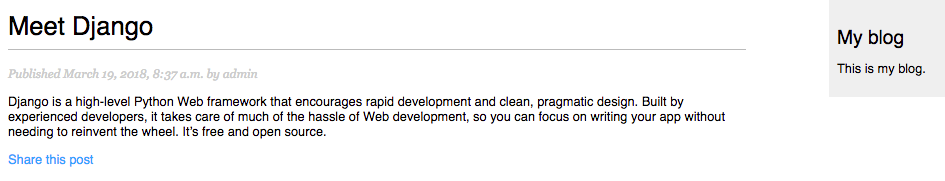

#CH2 使用高级特性增强博客功能

前面一章，我们建立了一个简单的 blog 应用。现在我们使用高级特性对 blog 进行完善，增加通过 e-mail 分享文章、添加评论、添加文章标签、获取相似文章等功能。这一章我们将学习以下内容：

- 使用 Django 发送 e-mails 

- 创建 forms 并在视图中处理它们

- 根据模型创建 forms 

- 集成第三方应用

- 创建复杂的 QuerySets

  ​

## 通过e-mail分享文章

******

首先，我们实现通过发送邮件的方式分享文章。想一下如何通过上一章学到 views 、URL's 和 templates 实现这个功能。要实现通过 e-mail 发送邮件，我们需要：

- 为用户创建一个表单来填写他们的名字、e-mail、接收文章的 e-mail 和评论（可选）；

- 在 views.py 文件中创建一个视图来处理 post 的数据并发送 e-mail ；

- 在 urls.py 文件中为新建的视图添加 URL 模式。

- 创建一个模板来展示表单。


### 使用Django创建表单

> 笔者注：
>
> 下面表述中 form 与表单意义相同。

我们从创建分享文章的表单开始。Django 内置的 form 框架帮助我们非常方便的创建表单。form 框架允许我们定义 form 的字段、指定字段展示方式、指定数据验证方法。Django form 框架还提供渲染表单和处理数据的方法。

Django提供两个类来创建表单:

- Form：帮助我们创建标准表单；

- ModelForm：帮助我们创建增加或者修改模型实例的表单。


首先，在 blog 应用的根目录新建一个名为 forms.py 的文件，并添加以下代码：

```python
from django import forms


class EmailPostForm(forms.Form):
    name = forms.CharField(max_length=25)
    email = forms.EmailField()
    to = forms.EmailField()
    comments = forms.CharField(required=False, widget=forms.Textarea)

```

这是你的第一个 Django 表单。我们来看一下代码：创建继承 Form 的表单类，使用不同的字段对输入进行验证。

> 注意：
>
> Forms 可以放在 Django 项目的任何位置，为了方便起见，我们将其放在每个应用的 forms.py 文件中。
>

name 字段是一个 CharField 。这种类型的字段渲染一个`<input type="text">`的 HTML元素。每一个字段都有默认的组件，这个组件决定 HTML 如何展示该字段。可以设置字段的 widget 属性覆盖默认的组件。在 comments 字段中，我们使用 Textarea 组件表示使用`<textarea>` HTML元素代替默认的 `<input>` 元素。

字段验证也依赖字段类型。例如，email 和 to 字段为 EmailField ，两个字段都需要有效地 e-mail 地址，否则字段验证将引发 forms.ValidationError 异常并且表单无法通过验证。表单验证还会考虑其他参数：我们定义了一个最大长度为 25 的 name 字段并将 comment 字段设置为 required=False 。表单验证时考虑这些参数。这个表单使用的字段类型只是 Django 表单字段的一小部分，所有的表单字段可以参考：https://docs.djangoproject.com/en/1.11/ref/forms/fields/。

### 在视图中处理表单

我们需要创建了一个新的视图来处理表单，并在表单成功提交时发送 e-mail 。编辑 blog 应用的 views.py 添加以下代码：

```python
from .forms import EmailPostForm


def post_share(request, post_id):
    # Retrieve post by id
    post = get_object_or_404(Post, id=post_id, status='published')

    if request.method == 'POST':
        # Form was submitted
        form = EmailPostForm(request.POST)
        if form.is_valid():
            # Form fields passed validation
            cd = form.cleaned_data
            # ... send email
    else:
        form = EmailPostForm()
    return render(request, 'blog/post/share.html', {'post': post, 'form': form})

```

这个表单将实现以下功能：

- 定义 post_share 视图，该视图输入参数为：request 对象和 post_id 。

- 使用 get_object_or_404() 通过 id 获取文章并要求文章状态为 published 。

- 使用相同的视图展示初始表单和处理提交数据。使用 request 方法区分表单是否提交，如果 request 方法为 GET ，我们将展示一个空表单；如果 request 方法为 POST ，表单将被提交并且需要处理。因此我们使用request.method="POST" 来区分这两种情况。


下面是展示和处理表单的过程：

1. 当使用 GET 方法请求视图时，我们创建一个新的表单实例(在模板中展示空的表单)：

   `form=EmailPostForm()`

2. 用户填写表单并通过 POST 提交，我们在 POST 部分使用提交的数据创建了一个表单实例：

    ```python
     if request.method == 'POST':
           # Form was submitted
           form = EmailPostForm(request.POST)
    ```

3. 使用 is_valid() 方法对提交的数据进行验证，这个方法对表单中的数据进行验证，如果数据均为有效数据，则会返回 Ture ，否则返回 False 。如果验证为 False 我们可以访问 form.errors 查看错误列表：

4. 如果表单没有通过验证，使用提交的数据再次渲染表单，并且在模板中显示验证错误。

5. 如果表单通过验证，通过 form.cleaned_data 访问数据，这个属性为表单字段名和值的字典。

    > 注意：
    >
    > 如果表单字段没有验证，cleaned_data 只包含通过验证的字段。


现在我们需要学习如何使用 Django 发送邮件了。


### 使用Django发送邮件


使用 Django 发送邮件非常简单。首先，我们需要一个本地 SMTP 服务器或者在项目 setting.py 中配置一个外部 SMTP 服务器：

- EMAIL_HOST: SMTP 服务器主机。默认为 localhost

- EMAIL_PORT: SMTP 服务器端口。默认为 25 

- EMAIL_HOST_USER: SMTP 服务器的用户名

- EMAIL_HOST_PASSWORD:  SMTP 服务器的密码

- EMAIL_USE_TLS: 是否使用 TLS 安全连接；

- EMAIL_USE_SSL: 是否使用隐式 SSL 安全连接。


如果没有本地 SMTP 服务器，可以使用 e-mail 服务商提供的 SMTP 服务器。下面的简单配置是使用  hotmail 服务器发送 e-mail 的配置(https://outlook.live.com/owa/?path=/options/popandimap)：

```python
EMAIL_HOST = 'smtp.gmail.com'
EMAIL_HOST_USER = 'your_account@gmail.com'
EMAIL_HOST_PASSWORD = 'your_password'
EMAIL_PORT = 587
EMAIL_USE_TLS = True
```

> 笔者注：
>
> 原文使用的是 Gmail，由于国内无法使用 Gmail，因此使用 hotmail 代替。
>
> 配置中，EMAIL_USE_TLS 和 EMAIL_USE_SSL 的默认设置都为False，需要配置其中一个为 True ，但是不能两个都设置为True。一般端口 587 对应 TLS ，端口 465 对应 SSL（加强 TSL ）。

在 teminal 中，跳转到项目根目录并输入命令 python manage.py shell 打开 Python shell 并发送邮件：

```python
from django.core.mail import send_mail
>>> send_mail('Django mail', 'This e-mail was sent with Django.', 'your_account@gmail.com', ['your_account@gmail.com'], fail_silently=False) 
```

send_mail() 参数包括主题、消息、发送者、接收者列表，通过设置 fail_silently=False 选项确定邮件没有正确发送时是否引发异常。如果send_mail 的输出为 1 ，那么邮件就正常发送了。如果 setting.py 设置 google web服务器，需要正常访问以下网址：https://www.google.com/settings/security/lesssecureapps。

> 笔者注：
>
> ####发送邮件测试
>
> 国内无法访问https://www.google.com/settings/security/lesssecureapps。因此，测试了 hotmail邮箱和163邮箱：
>
> 测试环境：python2.7、Django1.11
>
> #####hotmail邮箱
>
> 下面的简单配置是使用 hotmail 服务器发送 e-mail 的配置(https://outlook.live.com/owa/?path=/options/popandimap)：
>
> ```python
> EMAIL_HOST = 'smtp-mail.outlook.com'
> EMAIL_HOST_USER = 'your_account@hotmail.com'
> EMAIL_HOST_PASSWORD = 'your_password'
> EMAIL_PORT = 587
> EMAIL_USE_TLS = True
> ```
>
> 在 teminal 中，跳转到项目根目录并输入命令 python manage.py shell 打开 Python shell 并发送邮件：
>
> ```python
> from django.core.mail import send_mail
> >>> send_mail('Django mail', 'This e-mail was sent with Django.', 'your_account@hotmail.com', ['your_account@163.com'], fail_silently=False) 
> ```
>
> 如果 send_mail 第三个参数 your_account@hotmail.com 与 EMAIL_HOST_USER 一致，邮件正常发送。但是如果接收邮件只有阿里云企业邮箱，该邮箱没有返回，需要在程序中增加时间限制，否则邮件发送正常但是程序会长时间等待接收反馈信息而无法执行其他命令。
>
> 如果 send_mail 第三个参数与 EMAIL_HOST_USER 不一致，会引发 SMTPDataError 异常，无法发送邮件。
>
> #####163邮箱
>
> ```python
> EMAIL_HOST = 'smtp.163.com'
> EMAIL_HOST_USER = 'your_account@163.com'
> EMAIL_HOST_PASSWORD = 'your_auth_code'  #邮箱的授权码而非密码
> EMAIL_PORT = 465
> EMAIL_USE_SSL = True
> ```
>
> 在 teminal 中，跳转到项目根目录并输入命令 python manage.py shell 打开 Python shell 并发送邮件：
>
> ```python
> from django.core.mail import send_mail
> >>> send_mail('Django mail', 'This e-mail was sent with Django.', 'your_account@hotmail.com', ['your_account@163.com'], fail_silently=False) 
> ```
>
> 注意，这里的 password 不是邮箱密码，而是[邮箱]-[设置]-[POP3/SMTP/IMAP]中设置的授权码。
>
> 如果 send_mail 第三个参数与 EMAIL_HOST_USER 一致，引发 SMTPDataError: (554, 'DT:SPM 163 smtp11,D8CowADnvQK5UwFa6C2ZAw--.46120S2 1510036409,please see http://mail.163.com/help/help_spam_16.htm?ip=120.194.143.53&hostid=smtp11&time=1510036409')异常，http://mail.163.com/help/help_spam_16.htm?ip=120.194.143.53&hostid=smtp11&time=1510036409的对应内容为该邮件被视为垃圾邮件，更改主题与内容后仍无效。需要进一步了解 163 判断垃圾邮件的依据。
>
> 如果 send_mail 第三个参数为 hotmail 邮箱，邮件无法发送，引 发SMTPSenderRefused: (553, 'Mail from must equal authorized user') 异常。即发送信息邮箱必须与授权邮箱一致。
>
> #### 发送邮件测试总结
>
> 1. 测试环境：python2.7+Django1.11。
> 2. settings.py 尽量配置 hotmail 邮箱；
> 3. send_mail 中的发送邮箱最好与settings.py 中的授权邮箱一致。
>

现在，在视图中将添加发送邮件功能，将 blog 应用 views.py 中的 post_share 视图更改为：

```python
from .forms import EmailPostForm
from django.core.mail import send_mail


def post_share(request, post_id):
    # Retrieve post by id
    post = get_object_or_404(Post, id=post_id, status='published')
    sent = False

    if request.method == 'POST':
        # Form was submitted
        form = EmailPostForm(request.POST)
        if form.is_valid():
            # Form fields passed validation
            cd = form.cleaned_data
            # send email
            post_url = request.build_absolute_uri(post.get_absolute_url())
            subject = '{}({})recommends you read "{}"'.format(cd['name'],
                                                              cd['email'],
                                                              post.title)
            message = 'read"{}" at {} \n\n\'s comments:{}'.format(post.title,
                                                                  post_url,
                                                                  cd['name'],
                                                                  cd[
                                                                      'comments'])
            send_mail(subject, message, cd['email'], [cd['to']])
            sent = True
    else:
        form = EmailPostForm()
    return render(request, 'blog/post/share.html',
                  {'post': post, 'form': form, 'sent': sent})
```

这里定义了 sent 变量，邮件发送成功时 sent 设为 True 。我们将在模板中使用这个变量，当表单正确提交且邮件发送成功时显示成功信息。这里使用 get_absolute_url() 方法获取在文章的链接并使用 request.build_absolute_uri() 来封装这个函数从而构建包含 http 的完整 URL 。使用验证成功的表单的cleaned_data 作为邮件的主题和内容，然后将邮件发送到表单中 to 一栏中输入的地址。

现在视图完成了，我们为其添加 URL 模式，打开 blog 应用下的 urls.py 文件，添加以下内容：

```python
urlpatterns = [
    # ...
    url(r'^(?P<post_id>\d+)/share/$', views.post_share,
        name='post_share'),
]
```


### 在模板中渲染表单


创建完表单、完成视图并添加 URL 模式之后，还需要为视图添加模板。在 blog/templates/blog/post 目录下创建名为 share.html 的文件，添加以下内容：

```HTML


Share a post


    
        <h1>E-mail successfully sent</h1>
        <p>
            "{{ post.title }}" was successfully sent to {{ form.to.value }}.
        </p>
    
        <h1>Share "{{ post.title }}" by e-mail</h1>
        <form action="." method="post">
            {{ form.as_p }}
            
            <input type="submit" value="Send e-mail">
        </form>
    

```

> 笔者注：
>
> 由于{{ form.to }} 将渲染为 <input>元素，这里使用了 {{ form.to.value }}代替了原文的 {{ form.to }}。

这是展示表单的模板，邮件发送成功时模板会显示成功信息。我们创建了使用 POST 提交的表单：

```HTML
<form action="." method="post">
```

然后添加了表单实例，通过 as_p 方法告诉 Django 将表单字段渲染为 HTML 的 <p> 元素（我们还可以通过as_tabl e方法将字段渲染为<table>或者通过 as_ul 方法将字段渲染为<ul>）。如果需要渲染每个字段，可以对每个字段进行迭代：

```HTML
 
    <div>
      {{ field.errors }}
      {{ field.label_tag }}{{ field.field }}
    </div>
 
```

  模板标签添加一个为了防御 CSRF攻击自动生成的隐藏字段。关于 CSRF 可以从以下网站获取更多信息 https://en.wikipedia.org/wiki/Cross-site_request_forgery。这个模板标签将会自动生成一个隐藏输入：

```HTML
<input type='hidden' name='csrfmiddlewaretoken' value='4WZ53yXqRomGrnH1xFeaXlVGeqPQzgJdGAE3D9ZoWpY9qknlUFLNyRMgFqATIRea' />
```

> 注意：
>
> 默认情况下，Django 检查所有 POST 请求的 CSRFtoken 。因此我们需要为 POST 提交的表单添加csrf_token。


编辑 blog/post/detail.html 模板并在 {{ post.body|linebreaks }} 后添加分享链接：

```HTML
<p>
 <a href="">
    Share this post
 </a>
</p>
```

这里使用 Django 的  模板标签动态生成 URL 。这里使用的命名空间为 blog URL 为 post_share ，并传入 post.id 参数创建绝对 URL 。

现在，在 teminal 中，添加到项目根目录下并运行 python manage.py runserver  命令打开开发服务器，在浏览器中打开http://127.0.0.1:8000/blog/，点击任意文章标题到文章详细内容页面，正文后面将包含以下链接：



点击 Share this post ，我们将跳到分享邮件分享页面：


表单的 css 位于 static/css/blog.css 文件中。点击 send e-mail 按钮时，表单将被提交并验证。如果所有字段都通过验证，且邮件正常发送，我们将得到以下页面：


如果输入包含无效数据，将会看到包含错误信息的表单。

> 笔者注：
>
> chrome 浏览器需要填写需要填写好数据才能点击 send e-mail 按钮。


## 创建评论系统

******

我们为 blog 创建一个评论系统，用户可以在这里发表文章评论。需要做的工作包括：

- 创建一个模型，用于保存评论
- 创建一个表单，用于提交评论并验证
- 创建一个视图，用于处理表单并将新评论保存到数据库
- 编辑文章详细内容模板，展示评论列表及添加新评论的表单

首先，我们创建一个保存评论的模型。打开 blog 应用的 models.py 文件并添加以下代码：

```python
class Comment(models.Model):
    post = models.ForeignKey(Post, related_name='comments')
    name = models.CharField(max_length=80)
    email = models.EmailField()
    body = models.TextField()
    created = models.DateTimeField(auto_now_add=True)
    updated = models.DateTimeField(auto_now=True)
    active = models.BooleanField(default=True)

 ，   class Meta:
        ordering = ('created',)

    def __str__(self):
        return 'Comment by {} on {}'.format(self.name, self.post)
```

这是 Comment 模型，它包含与文章建立联系的外键 post ， Comment 中的这个多对一关系表示评论必须针对某篇文章但是一篇文章可以包含多条评论。post  中的 related_name 属性用于通过文章查看评论，定义完成后我们可以通过 comment.post 获得文章，通过 post.comments.all() 获得文章的所有评论。如果没有定义related_name 属性，Django 将使用模型名称的小写形式加`_set`后缀(即 comment_set )获得。

我们可以通过官网了解对多对一关系进行更多了解：https://docs.djangoproject.com/en/1.11/topics/db/examples/many_to_one/。

Comment 模型中设置了 active 字段来屏蔽某些评论。模型使用  create 字段对文章的评论进行默认排序。

我们刚刚创建的 Comment 模型需要同步到数据库，在 terminal 中，跳转到项目根目录并运行以下命令：

```python
python manage.py makemigrations blog
```

我们将看到以下输出：

```
Migrations for 'blog':
  blog/migrations/0002_comment.py
    - Create model Comment
```

Django 在 blog 应用的 migrations 文件夹下创建了`0002_comment.py`文件。现在需要运行以下指令：

```
python manage.py migrate
```

我们将看到以下输出：

```
Operations to perform:
  Apply all migrations: admin, auth, blog, contenttypes, sessions
Running migrations:
  Applying blog.0002_comment... OK
```

现在，数据库中多了一个名为 blog_comment 的数据库表。

然后，把新模型添加到 admin网站，打开 blog 应用的 admin.py 文件并添加以下代码：

```python

from .models import Post, Comment


class CommentAdmin(admin.ModelAdmin):
    list_display = ('name', 'email', 'post', 'created', 'active')
    list_filter = ('active', 'created', 'updated')
    search_fields = ('name', 'email', 'body')

admin.site.register(Comment, CommentAdmin)
```

运行 python manage.py runserver 命令启动开发服务器，在浏览器中打开 http://127.0.0.1:8000/admin/ ，可以看到 admin网站的 blog 中包含 Comments 模型：


现在我们可以通过 admin网站对 comment 实例进行管理。


### 创建模型表单


我们需要创建一个表单来帮助用户对文章进行评论。Django 提供两个创建表单的类：Form 和 ModelForm 。上一节我们使用 Form 实现通过邮件分享文章。由于需要创建的表单与 Comment 模型息息相关，因此本节需要使用 ModelForm 。编辑 blog 应用的 forms.py 文件并添加以下内容：

```python
from .models import Comment

class CommentForm(forms.ModelForm):
    class Meta:
        model = Comment
        fields = ('name', 'email', 'body')
```

创建模型表单只需在表单的 Meta 类中申明使用哪个模型即可。每个模型字段类型都有对应的表单字段类型，表单验证使用我们定义的模型字段类型。默认情况下，Django 为模型中的所有字段创建一个表单字段。然而，也可以在表单的 Meta 类中使用 fields 设置希望包含的字段。CommentForm 只使用 name、email 和 body 字段。

###在视图中处理ModelForms

我们使用文章详细视图对表单进行实例化并进行处理。编辑 blog 应用的 views.py 文件并将 post_detail 修改为：

```python

from .forms import EmailPostForm, CommentForm
from .models import Post, Comment


def post_detail(request, year, month, day, slug):
    post = get_object_or_404(Post, slug=slug, status='published',
                             publish__year=year, publish__month=month,
                             publish__day=day)

    # list of active comments for this post
    comments = post.comments.filter(active=True)
    if request.method == "POST":
        # a comment was posted
        comment_form = CommentForm(data=request.POST)
        if comment_form.is_valid():
            # create comment object but don't save to database yet
            new_comment = comment_form.save(commit=False)
            # assign the current post to the comment
            new_comment.post = post
            # save the comment to the database
            new_comment.save()
    else:
        comment_form = CommentForm()
    return render(request, 'blog/post/detail.html',
                  {'post': post, 'comments': comments,
                   'comment_form': comment_form})
```

我们来看一下视图添加的内容。使用 post_detail 视图来展示文章和评论。我们添加了一个 queryset 来获取这篇文章所有处于激活状态的评论：

```python
comments = post.comments.filter(active=True)
```

这个 queryset 以 post 开始，comments 是 Comment 模型中 post 多对一关系字段使用 related_name 定义的反向查询名称。

我们还用这个视图实现添加新评论的功能。如果 request 使用 GET 请求则使用`comment_form=CommentForm()`创建一个表单实例。如果 request 使用 POST 请求则使用提交的数据实例化表单并通过表单的 is_valid() 方法验证提交的数据。如果表单数据无效，我们使用验证错误渲染模板。如果表单数据有效，则实现以下功能：

1. 调用表单的 save() 方法创建了一个新的 Comment 对象：

```python
new_comment = comment_form.save(commit=False)
```

`save()` 方法创建了一个表单对应模型的实例并将其保存到数据库。如果调用它时设置了`commit=False`，那么只创建模型实例，不会将实例保存到数据库，这样我们可以在保存之前手动修改模型实例。注意，只有 ModelForm 实例具有 save() 方法，Form 实例没有该方法。

2. 将刚刚创建的 comment 实例的 post 字段设置为当前文章：

   ```python
   new_comment.post = post
   ```

   通过这一步，我们指定新的评论属于这篇文章。

3. 最后，将新的评论保存到数据库中：

   ```python
   new_comment.save()
   ```

现在，视图可以展示并且处理新的评论了。


### 为文章模板添加评论


我们已经实现管理文章评论的功能。现在，需要对 post/detail.html 模板进行修改以实现以下功能：

- 展示文章的评论总数；

- 展示评论列表；

- 展示用户添加新评论用的表单；

> 笔者注：
>
> 原文为 post_detail.html，应该是 blog 应用 templates/blog/post/detail.html。

首先，添加总评论数。打开 post/detail.html 模板并在 content block 中添加以下代码：

```html
    
    <h2>
        {{ total_comments }} comment{{ total_comments|pluralize }}
    </h2>
    
```

我们在模板中使用 Django ORM 执行 queryset `comments.count()`。注意，Django 模板语言不使用括号调用函数。``标签用于将值绑定到一个新的变量中，endwith 之前的内容都可以是使用这个新的变量。

> 注意：
>
> ``模板标签可以避免多次查询数据库或者访问消耗较大的方法。

我们使用 pluralize 模板过滤器为 comment 设置复数形式，pluralize 依赖于 total_comments 的值，如果total_comments 的值不为1，则 {{ total_comments|pluralize }} 为 's' 否则为 '' ，即渲染为 0 comments、1 comment、N comments。Django 提供许多展示信息的模板标签和过滤器，我们将在第三章详细讨论模板过滤器。

现在，添加评论列表。在上面的代码后面添加以下代码：

```html
    
        <div class="comment">
            <p class="info">
                Comment {{ forloop.counter }} by {{ comment.name }}{{ comment.created }}
            </p>
                {{ comment.body|linebreaks }}
        </div>
    
        <p>There are no comments yet.</p>
    
```

我们使用``标签对 comments 进行循环。如果 comments 为空，将展示默认信息来告诉用户暂时没有评价。使用`{{ forloop.counter }} ` 获得 comment 的索引。然后展示提交评论的用户的姓名、时间及评论内容。

最后，需要渲染表单来展示表单成功提交时显示的信息。在前面代码后面添加以下代码：

```html
    
        <h2> Your comment has been added.</h2>
    
        <h2>Add a new comment</h2>
        <form action="." method="post">
            {{ comment_form.as_p }}
            
            <p><input type="submit" value="Add comment"></p>
        </form>
    
```

代码很清晰，如果存在 new_comment 对象，展示评论成功提交信息；否则，使用`<p>`元素渲染表单的每个字段并为表单的 POST 请求添加 csrf token。在浏览器中打开 http://127.0.0.1:8000/blog/ 点击任意一篇文章跳转到文章页面，我们将看到下面的内容：


使用表单添加一些评论，在文章下可以看到按创建时间排序的评论：


在浏览器中打开 http://127.0.0.1:8000/admin/blog/comment/  将看到评论列表。点击其中的一个进行编辑，取消选中 Active ，我们将再次看到评论列表，看起来是这样的：


如果回到文章页面，我们将发现刚刚编辑的评论不见了，评论数也减少了一条。这是由于我们在获取评论时过滤了active 为 False 的评论。


## 添加标签功能

******

完成评论系统后我们开始为文章添加标签。通过在项目中引入 Django 第三方库来实现标签功能。django-taggit 是一个可复用的应用，它的主要功能是提供 Tag 模型和便于为任何模型添加标签的管理器，可以在 https://github.com/alex/django-taggit 找到它的源代码。

首先，我们需要通过 pip 安装 django-taggit ，在terminal 中运行以下命令：

```python
pip install django-taggit
```

然后打开项目的 settings.py 文件并将 taggit 添加到 INSTALLED_APPS 中：

```python
INSTALLED_APPS = ['django.contrib.admin', 'django.contrib.auth',
                  'django.contrib.contenttypes', 'django.contrib.sessions',
                  'django.contrib.messages', 'django.contrib.staticfiles',
                  'blog', 'taggit']
```

打开 blog 应用的 models.py 文件，在 Post 模型中添加 django-taggit 提供的 TaggableManager 管理器：

```python
from taggit.managers import TaggableManager


class Post(models.Model):
    # ...
    tags = TaggableManager()
```

tags 管理器帮助我们为文章添加、获取、删除标签。

打开 Terminal ，在项目的根目录下执行以下命令将模型变更同步到数据库：

```python
python manage.py makemigrations
```

我们会看到以下输出：

```python
Migrations for 'blog':
  blog/migrations/0003_post_tags.py
    - Add field tags to post
```

然后执行以下命令：

```python
python manage.py migrate
```

我们会看到以下输出：

```python
Operations to perform:
  Apply all migrations: admin, auth, blog, contenttypes, sessions, taggit
Running migrations:
  Applying taggit.0001_initial... OK
  Applying taggit.0002_auto_20150616_2121... OK
  Applying blog.0003_post_tags... OK
```

现在数据库中包含 django-taggit 模型了，打开 terminal 并运行`python manage.py shell`学习如何使用 tags 管理器。首先，我们选择一篇文章（id=1的文章）：

```python
In [2]: from blog.models import Post

In [3]: post = Post.objects.get(id=1)
```

然后为文章添加一些标签，然后获取这篇文章的标签以确定标签是否添加成功：

```python
In [4]: post.tags.add('music','jazz','django')

In [5]: post.tags.all()
Out[5]: <QuerySet [<Tag: jazz>, <Tag: music>, <Tag: django>]>
```

最后，删除一个标签，并再次查看文章的所有标签：

```python
In [6]: post.tags.remove('django')

In [7]: post.tags.all()
Out[7]: <QuerySet [<Tag: jazz>, <Tag: music>]>
```

使用 python manage.py runserver 命令运行开发服务器。在浏览器中打开 http://127.0.0.1:8000/admin/taggit/tag，你将看到 admin 网站上 taggit 应用的 Tag 对象列表：


跳转到 http://127.0.0.1:8000/admin/blog/post/，点击任意一个文章对象，你将看到文章对象现在包含一个这样的 Tags 字段：


现在，我们编辑 blog 文章来展示 tags 。打开 blog/post/list.html 模板并在文章标题下添加以下代码：

```html
        <p class="tags">Tags:{{ post.tags.all|join:"," }}</p>
```

模板过滤器 join 与 python 的 join 函数功能类似，都是用来连接给定的字符串的。打开 http://127.0.0.1:8000/blog/，我们可以看到文章标题下增加了标签：


现在我们将编辑 post_list 视图实现查找特定标签的所有文章的功能。打开 blog 应用的 views.py 文件，将post_list 函数更改为

```python
from taggit.models import Tag


def post_list(request, tag_slug=None):
    object_list = Post.objects.all()
    tag = None
    if tag_slug:
        tag = get_object_or_404(Tag, slug=tag_slug)
        object_list = object_list.filter(tags__in=[tag])
```

这个视图是这样工作的：

1. 视图接收可选的 tag_slug 输入参数，该参数的默认值为 None ，这个参数的值来自于 URL 。
2. 在视图中，创建初始 queryset 获得所有发布的文章，如果 URL 传入了有效的 tag_slug ，则使用get_object_or_404 获得满足 slug 要求的 Tag 对象（ Tag 模型中的 slug 应该是唯一的）；
3. 根据步骤 2 得到的 tag 对文章列表进行过滤。由于这是一个多对多关系，我们需要使用 tags 进行过滤得到给定列表，本项目暂时只有一篇文章满足标签要求。

Queryset 是惰性的。只有循环时 Queryset 才会执行文章查询。

最后更改 post_list 视图底部的 render() ，将 tag 传到模板中。

```python
from taggit.models import Tag


def post_list(request, tag_slug=None):
    object_list = Post.objects.all()
    tag = None
    if tag_slug:
        tag = get_object_or_404(Tag, slug=tag_slug)
        object_list = object_list.filter(tags__in=[tag])

    paginator = Paginator(object_list, 1)  # 1 posts in each page
    page = request.GET.get('page')
    try:
        posts = paginator.page(page)
    except PageNotAnInteger:
        # If page is not an integer deliver the first page
        posts = paginator.page(1)
    except EmptyPage:
        # If page is out of range deliver last page of results
        posts = paginator.page(paginator.num_pages)
    return render(request, 'blog/post/list.html',
                  {'page': page, 'posts': posts, 'tag': tag})
```

打开 blog 应用的 urls.py 文件，注释 PostListView 的 URL 模式并去掉 post_list 的注释，现在代码是这样的：

```python
from django.conf.urls import url

from . import views
urlpatterns = [
    url(r'^$', views.post_list, name='post_list'),# post views
    # url(r'^$', views.PostListView.as_view(), name='post_list'),
    url(r'(?P<year>\d{4})/(?P<month>\d{2})/(?P<day>\d{2})/(?P<slug>[-\w]+)/$',
        views.post_detail, name='post_detail'),
    url(r'(?P<post_id>\d+)/share/$', views.post_share, name='post_share')]
```

添加以下 URL 模式实现通过 tag 获得 post 列表：

```python
url(r'^tag/(?P<tag_slug>[-\w]+)/$', views.post_list, name='post_list_by_tag'),
```

我们可以看到，两个 URL 模式指向相同的视图，但是使用了不同的名称。第一个名为 post_list ，不需要传入任何参数，第二个名为 post_list_by_tag ，需要传入 tag_slug 参数。

由于我们使用的是 post_list 视图，编辑 blog/post/list.html ，将分页对象更改回 posts：

```html

    

```

在  循环上面添加下面的内容：

```
    
        <h2>Posts tagged with "{{ tag.name }}"</h2>
    
```

如果用户正在访问 blog ，他将看到所有文章列表，如果他使用特定 tag 进行过滤，他将看到`<h2>Posts tagged with "{{ tag.name }}"</h2>`，现在将文章标题下 tags 的展示方法更改为( post/list.html 中 )：

```html

        <p class="tags">Tags:
            
                <a href="">
                    {{ tag.name }}
                </a>
                ,
            
        </p>
        
```

现在我们通过自定义链接链接到 URL 来通过标签对文章进行过滤，我们使用  创建 URL，然后通过逗号分隔标签。

在浏览器中打开 http://127.0.0.1:8000/blog/ 并点击任意标签，我们将看到：


## 查找同类文章

******

现在，我们已经为 blog 添加了标签，可以通过它实现很多好玩的功能。通过标签，我们可以对文章进行分类。相同主题的文章可能会有几个共同的标签，我们将创建一个函数来展示拥有共同标签的文章。这样，当用户阅读文章时可以为他们推送相关文章。

为了获取某一文章的同类文章，我们需要:

- 获取当前文章的所有标签；
- 获得所有具备这些标签的文章；
- 从得到的列表中排除当前文章以避免推荐同一文章；
- 通过与该文章共用标签的数量从多到少对文章进行排序；
- 对于共用标签数目相同的文章，首先推荐最新的文章；
- 控制推荐文章的总数。

这些步骤可以转化为 post_detail 视图中一个复杂的 queryset 。打开 blog 应用的 views.py 文件并在文件的最上面添加以下内容：

```python
form django.db.models import Count
```

这是 Django ORM 的聚合函数 Count ，这个函数用于实现聚合计数。然后在 post_detail 函数的 render() 方法之前添加以下代码：

```python
	# list of similar posts
    post_tags_ids = post.tags.values_list('id', flat=True)
    similar_posts = Post.published.filter(tags__in=post_tags_ids).exclude(
        id=post.id)
    similar_posts = similar_posts.annotate(same_tags=Count('tags')).order_by(
        '-same_tags', '-publish')[:4]
```

> 笔者注：
>
> 为了更清楚的了解这个 queryset 如何实现，可以使用以下命令打印 similar_post 执行的 SQL 语句:
>
> ```python
> print(similar_posts.query)
> ```
>
> 对应的 SQL 语句为:
>
> ```SQL
> SELECT "blog_post"."id", "blog_post"."title", "blog_post"."slug", "blog_post"."author_id", "blog_post"."body", "blog_post"."publish", "blog_post"."created", "blog_post"."updated", "blog_post"."status", COUNT("taggit_taggeditem"."tag_id") AS "same_tags" 
>
> FROM "blog_post" INNER JOIN "taggit_taggeditem" ON ("blog_post"."id" = "taggit_taggeditem"."object_id" AND ("taggit_taggeditem"."content_type_id" = 7)) 
>
> WHERE ("taggit_taggeditem"."tag_id" IN (SELECT DISTINCT U0."id" AS Col1 FROM "taggit_tag" U0 INNER JOIN "taggit_taggeditem" U1 ON (U0."id" = U1."tag_id") WHERE (U1."object_id" = 1 AND U1."content_type_id" = 7)) AND NOT ("blog_post"."id" = 1)) GROUP BY "blog_post"."id", "blog_post"."title", "blog_post"."slug", "blog_post"."author_id", "blog_post"."body", "blog_post"."publish", "blog_post"."created", "blog_post"."updated", "blog_post"."status" 
> ORDER BY "same_tags" DESC, "blog_post"."publish" DESC LIMIT 4
> ```
>

这些代码的功能为:

1. 获取当前文章所有 tag 的id ，queryset 的 values_list() 返回指定字段的元组列表，我们为其传入 flat=True 来直接获得字段值列表（而不是元组列表）[1,2,3…]；
2. 获得除当前文章以外的所有具备这些标签的文章；
3. 通过聚合函数 Count 生成一个计算字段 same_tags ，该字段为包含相同标签的数量；
4. 按照共有标签数量降序及相同标签时发布时间降序对文章进行排序，然后截取前 4 篇文章。

在 render() 函数中添加 similar_posts 对象:

```python
render(request, 'blog/post/detail.html',
                  {'post': post, 'comments': comments,
                   'comment_form': comment_form,
                   'similar_posts':similar_posts})
```

现在，编辑 blog/post/detail.py 模板并在文章评论之前添加以下代码：

```python
    <h2>Similar posts</h2>
    
        <p>
            <a href="{{ post.get_absolute_url }}">{{ post.title }}</a>
        </p>
    
        <p>There are no similar posts yet.</p>
    
```

我们可以使用为文章列表添加标签的方法为文章添加标签，即整个 html 最终为：

```python


{{ post.title }}


    <h1>{{ post.title }}</h1>
    <p class="date">
        Published {{ post.publish }} by {{ post.author }}
    </p>
    <p class="tags">Tags:
            
                <a href="">
                    {{ tag.name }}
                </a>
                ,
            
        </p>
    {{ post.body|linebreaks }}
    <p>
        <a href="">
            Share this post
        </a>
    </p>
    <h2>Similar posts</h2>
    
        <p>
            <a href="{{ post.get_absolute_url }}">{{ post.title }}</a>
        </p>
    
        <p>There are no similar posts yet.</p>
    


    
        <h2>
            {{ total_comments }} comment{{ total_comments|pluralize }}
        </h2>
    

    
        <div class="comment">
            <p class="info">
                Comment {{ forloop.counter }}
                by {{ comment.name }} {{ comment.created }}
            </p>
            {{ comment.body|linebreaks }}
        </div>
    
        <p>There are no comments yet.</p>
    

    
        <h2> Your comment has been added.</h2>
    
        <h2>Add a new comment</h2>
        <form action="." method="post">
            {{ comment_form.as_p }}
            
            <p><input type="submit" value="Add comment"></p>
        </form>
    

```

现在的文章页面看起来是这样的：


你可以成功的向用户推荐相似文章了，django-taggit 还包含一个 similar_object() 的管理器来帮助我们获取具有相同标签的文章列表，我们可以在下面链接中查看 django-taggit 的所有管理器：http://django-taggit.readthedocs.io/en/latest/api.html。

## 总结

本章，我们学习如何使用 forms 和 modelforms 。我们实现了通过邮件分享文章、创建文章评论系统、为文章添加标签、集成可复用的应用并创建复杂的 queryset 来查找同类文章。

下一章中，我们将学习如何创建自定义模板标签及过滤器。还将创建自定义 sitemap 、为 blog 文章供稿以及为应用集成高级搜索引擎。