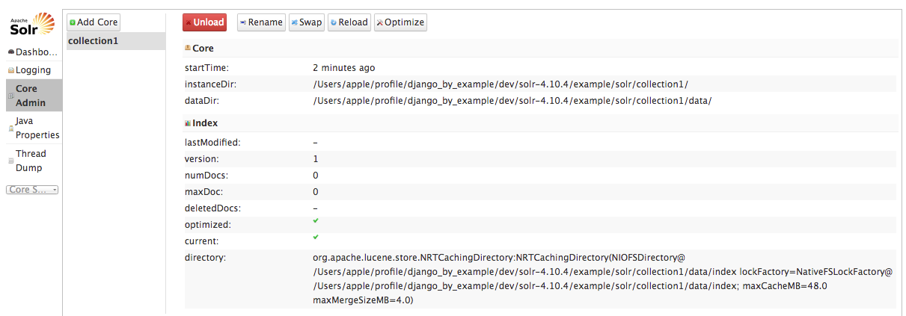

# CH3 扩展 blog 应用


上一章我们学习了表单基础知识及如何在项目中集成第三方应用。本章的要点包含：

- 创建自定义模板标签和过滤器

- 添加 sitemap 和文章 feed

- 使用 Solr 和 Haystack 创建搜索引擎

  ​

## 创建自定义模板标签和过滤器

******

Django 提供许多内置标签（比如  、 等），我们已经在前面的开发过程中使用了一些。下面的链接包括 Django 所有的内置标签和过滤器：https://docs.djangoproject.com/en/1.11/ref/templates/builtins/。

Django 允许我们创建自定义标签来实现自定义动作。如果我们需要实现 Django 内置模板标签无法覆盖的功能时可以创建自定义标签。


### 创建自定义模板标签


Django 提供以下帮助函数帮助我们快速创建自定义模板标签：

- simple_tag: 处理数据并返回字符串

- inclusion_tag: 处理数据并返回渲染的模板

- assignment_tag:  处理数据并在 context 中设置变量

  ​

> 译者注：
>
> Django 1.9 版本之后，可以使用 simple_tag 实现 assignment_tag 的功能，因此，现在已经弃用  assignment_tag 。
>


模板标签必须位于 Django 应用内。

在 blog 应用根目录下创建名为 templatetags 的目录，并在新建目录下创建名为`__init__.py`的空文件，然后在与该空文件相同的目录下创建名为 `blog_tags.py` 的文件。目录及文件创建完成后的 blog 应用文件结构是这样的：


文件的名称很重要，你将在模板中使用这个名称加载自定义模板标签。

我们首先创建一个 simple_tag ，该标签获取 blog 发布的文章数量。编辑 blog_tags.py 文件，添加以下代码：

```python
from django import template

register = template.Library()

from ..models import Post


@register.simple_tag
def total_posts():
    return Post.published.count()
```

我们已经创建了一个返回发布文章数量的简单模板标签。每个模板标签模块都需要包含一个名为 register 的变量，这个变量是 template.Library 实例，用于注册自定义模板标签或过滤器。然后我们使用 python 函数定义一个名为 total_posts 的模板标签，并使用`@register.simple_tag`装饰器注册标签。Django 将使用函数的名称作为标签名称。如果需要使用其它名称，可以将 `@register.simple_tag`  更改为 `@register.simple_tag(name='my_tag')` 。


> 注意：
>
> 添加模板标签模块后，需要重启 Django开发服务器才能使用新的自定义模板标签和过滤器。
>


在使用自定义模板标签之前，需要使用``标签进行加载。打开 blog/base.html 模板，并在开始的位置添加 `` 来加载模板标签模块，然后通过添加``来使用创建的标签表示所有文章，模板最终看起来是这样的：

```html



<!DOCTYPE html>
<html>
<head>
    <title></title>
    <link href="" rel="stylesheet">
</head>
<body>
<div id="content">
    
    
</div>
<div id="sidebar">
    <h2>My blog</h2>
    <p>This is my blog. I've written  posts so far.</p>
</div>
</body>
</html>
```

我们需要重启开发服务器来追踪将添加到项目的新文件，按 Ctrl+C 停止开发服务器并运行以下命令启动开发服务器：

```python
python manage.py runserver
```

在浏览器中打开 http://127.0.0.1:8000/blog/ ，我们可以在右侧边栏看到所有已发布的文章信息


> 译者注：
>
> 由于模板标签的 queryset 使用的是 published 管理器，因此需要设置文章的状态（通过 admin网站或者 python manage.py shell）来得到要想的结果。


自定义标签的强大之处在于可以处理任何数据以及可以添加到任意模板，我们可以在模板中展示 Queryset 或者 任何数据的处理结果。

现在，我们将创建另一个模板标签(在 blog 边栏展示最新文章）。这次我们使用 inclusion 标签。inclusion 标签可以对内容进行渲染。编辑 blog_tags.py 文件并添加以下代码：

```python
@register.inclusion_tag('blog/post/latest_posts.html')
def show_latest_posts(count=5):
    latest_posts = Post.published.order_by('-publish')[:count]
    return {'latest_posts': latest_posts}
```

在这段代码中，我们使用`register.inclusion_tag`注册模板标签并设置返回数据渲染所用的模板 `blog/post/latest_posts.html` 。模板标签可以输入可选的 count 参数（默认值为 5 ）。我们使用这个变量来限制 `Post.published.order_by('-publish')`  结果的数量。注意，这个函数返回变量字典而不是单个值。Inclusion标签需要返回值的字典作为特定模板的内容。我们刚刚创建的模板可以传入可选的文章数量并这样进行显示 ``。

现在，在 templates/blog/post 目录下新建一个名为 latest_posts.html 模板文件并添加以下代码：

```html
<ul>
    
        <li>
            <a href="{{ post.get_absolute_url }}">{{ post.title }}</a>
        </li>
    
</ul>
```

这里，我们使用 latest_posts 展示无序的文章列表并通过标签返回。现在，编辑 blog/base.html 模板并通过添加新的模板标签展示最新的 3 篇文章。sidebar 应该是这样的：

```html
<div id="sidebar">
    <h2>My blog</h2>
    <p>This is my blog. I've written  posts so far.</p>
    <h3>Latests posts</h3>
    
</div>
```

通过传入要展示的文章数量调用模板标签，模板已经对给定内容进行了渲染。

现在回到浏览器刷新一下页面，边栏现在是这样的了：


最后，我们再次使用 simple_tag 创建一个 assignment_tag 功能的标签，该功能是将返回的值保存在一个变量中。我们将创建一个标签来展示评论最多的文章。编辑 blog_tags.py 文件，并添加以下代码：

```python
from django.db.models import Count

@register.simple_tag
def get_most_commented_posts(count=5):
    return Post.published.annotate(total_comments=Count('comments')).order_by(
        '-total_comments')[:count]
```
> 译者注：
>
> 由于 assignment_tags 已经废弃，这里使用 simple_tag 代替原文中的 assignment_tags。


Queryset 使用 annotate() 函数进行聚合查询（使用 Count 聚合函数）。创建 total_comments 字段保存每篇文章评论数量的 queryset 并通过该字段对查询结果进行排序。我们还提供可选的 count 参数限制返回对象的数量。

除了 Count ，Django 还提供 Avg 、Max 、Min 、 Sum 等聚合函数。我们可以通过阅读官网资料对聚合函数进行更多了解：https://docs.djangoproject.com/en/1.11/topics/db/aggregation/。

编辑 blog/base.html 模板并在 sidebar 中添加以下代码：

```html
    <h3>Most commented posts</h3>
    
    <ul>
        
        <li>
            <a href="{{ post.get_absolute_url }}">{{ post.title }}</a>
        </li>
        
    </ul>
```

这里最大的区别在于使用 `` 。在代码中，我们使用了 `` 。这样可以将标签结果保存到一个名为most_commented_posts 的变量中，然后使用无序列表对返回的文章进行展示。

现在，刷新浏览器，我们将看到这样的页面：


我们可以阅读官方文档了解更多关于模板标签的内容：https://docs.djangoproject.com/en/1.11/howto/custom-template-tags/。


### 创建自定义模板过滤器


Django 内置许多模板过滤器来帮助我们修改模板中的变量。它们是包含一个或两个输入（第一个是要操作的对象，第二个是可选参数）的 python 函数。它们返回一个可以被其它过滤器处理的值。一个过滤器看起来是这样的 {{ variable|my_filter}} 或者可以传递参数的 {{ variable|my_filter: 'foo' }} 。我们可以为一个变量使用任意数量的过滤器 {{ variable|filter1|filter2 }} ，它们中的每一个将使用前一个过滤器的输出作为输入。

我们将创建一个自定义过滤器在 blog 文章中使用 markdown 语法然后在模板中将文章内容转换为 HTML 。markdown 是一个简单易用的文本格式语法并且可以转换为 HTML 。我们可以了解它们的基本格式：https://daringfireball.net/projects/markdown/basics。

首先通过 pip 安装 Python markdown 模块：

```python
pip install Markdown
```

然后编辑 blog_tags.py 文件，添加以下代码：

```python
from django.utils.safestring import mark_safe
import markdown


@register.filter(name='markdown')
def markdown_format(text):
    return mark_safe(markdown.markdown(text))
```

模板过滤器的注册方法与模板标签的注册方法相同。为避免函数名与 markdown 模块混淆，我们将函数命名为 markdown_format 并将过滤器命名为 markdown 以便在模板中使用 {{ variable|markdown }} 。Django 不对过滤器生成的 HTML 代码进行转义。因此，我们使用 Django 提供的 mark_safe 函数对结果进行转义来保证可以在模板中进行渲染。默认情况下，Django 不信任任何 HTML 代码并在输出之前进行转义。变量被标记为 safe 是唯一的例外。这个特性可以防止 Django 生成存在潜在危险的 HTML ，并允许用户在知道代码可以返回安全的 HTML 时不进行转义。

现在，在 post/list.html 和 post/detail.html 中的  后面加载模板标签：

```

```

在 post/detail.html 中使用：

```
{{ post.body|markdown }}
```

代替

```
{{ post.body|linebreaks }}
```

然后，在post/list.html中，使用：

```
{{ post.body|markdown|truncatechars_html:30 }}
```

代替

```
{{ post.body|truncatewords:30|linebreaks }}
```


truncatechars_html 过滤器将截取一定字符的字符串，避免未关闭的 HTML 标签。

现在，在浏览器中打开 http://127.0.0.1:8000/admin/blog/post/add/ 页面并添加以下内容的文章：

```markdown
This is a post formatted with markdown

*This is emphasized* and **this is more emphasized**.

Here is a list:

- One
- Two
- Three

And a [link to the Django website](https://www.djangoproject.com/)
```


打开浏览器，我们来看下这篇文章如何渲染，我们应该看到这样的效果：


我们可以看到，自定义模板过滤器可以有效的自定义格式，通过以下链接可以了解更多内容：https://docs.djangoproject.com/en/1.11/howto/custom-template-tags/。


## 添加 sitemap

******

Django 内置 sitemap 框架（动态生成网站的 sitemaps ）。sitemap 是一个 XML文件，用于向搜索引擎提供网站上的页面、相关性及更新频率。使用 sitemap ，可以帮助网络搜索器检索网站内容。

Django sitemap 框架依赖 django.contrib.sites（允许项目的特定网站与对象建立联系）。用于处理使用一个Django 项目运行多个网站的情况。安装 sitemap 框架，需要在项目中同时激活 sites 和 sitemap 两个应用。编辑项目的 settings.py 文件，在 INSTALLED_APPS 中添加 django.contrib.site 和 django.contrib.sitemaps ，然后设置 site ID ：

```python
SITE_ID = 1

# Application definition

INSTALLED_APPS = ['django.contrib.admin', 
                  'django.contrib.auth',
                  'django.contrib.contenttypes',
                  'django.contrib.sessions',
                  'django.contrib.messages',
                  'django.contrib.staticfiles',
                  'blog', 
                  'taggit',
                  'django.contrib.sites',
                  'django.contrib.sitemaps']
```

现在，运行以下命令将 sites 应用的模型同步到数据库：

```
python manage.py migrate
```

我们将看到这样的输出：

```
Operations to perform:
  Apply all migrations: admin, auth, blog, contenttypes, sessions, sites, taggit
Running migrations:
  Applying sites.0001_initial... OK
  Applying sites.0002_alter_domain_unique... OK
```

sites 应用的模型现在已经同步到数据库了。现在，我们在 blog 应用目录下新建一个名为 sitemaps.py 的文件，打开文件并添加以下代码：

```python 
from django.contrib.sitemaps import Sitemap

from .models import Post


class PostSitemap(Sitemap):
    changefreq = 'weekly'
    priority = 0.9

    def items(self):
        return Post.published.all()

    def lastmod(self, obj):
        return obj.publish
```

我们继承 sitemap 模块的 Sitemap 类创建自定义 sitemap 。changefreq 和 priority 属性表示文章页面更新频率和与网站的相关性（最大值为 1 ）。items 方法为 sitemap 返回对象的queryset。默认情况下，Django 调用模型的 get_absolute_url() 方法来获取模型对象的 URL ，我们在第一章的 Post 模型中定义了 get_absolute_url() 方法。如果希望指定每篇文章的 URL ，那么可以为 sitemap 类添加 location 方法。lastmod 方法获得 item() 返回的每个对象并返回文章的最新修改时间。changefreq 和 priority 可以是方法或属性。sitemap 更多的内容详见：https://docs.djangoproject.com/en/1.11/ref/contrib/sitemaps/。

最后，我们只需要添加 sitemap URL，编辑项目的 urls.py 文件，并修改成这样：

```python 

from django.conf.urls import url, include
from django.contrib import admin
from django.contrib.sitemaps.views import sitemap

from blog.sitemaps import PostSitemap

sitemaps = {'post': PostSitemap, }

urlpatterns = [url(r'^admin/', admin.site.urls),  
               url(r'^blog/',include('blog.urls',namespace='blog',
                                     app_name='blog')),
               url(r'^sitemap\.xml$', sitemap, {'sitemaps': sitemaps},
                   name='django.contrib.sitemaps.views.sitemap')]
```

现在，我们导入了需要的模块并定义了一个 sitemaps 字典，定义了一个匹配 sitemap.xml 并使用 sitemap 视图的 URL 模式，sitemaps 字典传入 sitamap 视图，现在在浏览器中打开 http://127.0.0.1:8000/sitemap.xml ，我们将看到这样的 XML ：

：


每篇文章的 URL 通过调用它的 get_absolute_url() 获得。lastmod 属性对应我们在 sitemap 中指定的文章的 publish 字段，changefreq 和 priority 属性也是从 PostSitemap 中获得的。我们可以看到，创建 URL 时使用的域名为 example.com 。这个域名来自于数据库中存储的一个 Site 对象，我们同步 sites 框架时会创建默认对象 example.com。现在在浏览器中打开 http://127.0.0.1:8000/admin/sites/site/ ，你将看到：


这是 sites 框架的域名列表视图。我们可以设置 sites 框架使用的域名或主机。为了生成本地环境的 URL ，将域名更改为 127.0.0.0:8000 ：


为了便于开发，我们将域名指定为本地主机。在生产环境中，则需要使用自己的域名。


### 为blog文章创建feeds


Django 内置 syndication feed 框架（动态生成 RSS 或 Atom feeds ），这个框架的使用方法与 sitemap 框架类似。

在 blog 应用目录下创建一个名为 feeds.py 的文件，并添加以下代码：

```python
from django.contrib.syndication.views import Feed
from django.template.defaultfilters import truncatewords

from .models import Post


class LatestPostsFeed(Feed):
    title = 'My blog'
    link = '/blog'
    description = 'New posts of my blog'

    def items(self):
        return Post.published.all()[:5]

    def item_title(self, item):
        return item.title

    def item_description(self, item):
        return truncatewords(item.body, 30)
```

首先，我们创建 LatestPostFeed 类，它是 syndication 框架 Feed 类的子类。其中 title 、 link 和 description 属性分别与 RSS 的 <title> 、 <link> 和 <discription> 对应。

items() 方法获取 feed 包含的对象。这个 feed 只包含最新的 5 篇文章。item_title() 和 item_description() 方法获得 items() 返回的每个对象并为每个对象返回名称和描述。item_description() 使用内置的模板过滤器 truncateword 截取文章的前 30 个词作为描述。

现在，编辑 blog 应用的 urls.py 文件，导入刚刚创建的 LatestPostFeed ，并在新的 URL 模式中进行实例化：

```python
from django.conf.urls import url

from . import views
from .feeds import LatestPostsFeed

urlpatterns = [url(r'^$', views.post_list, name='post_list'),  # post views
    # url(r'^$', views.PostListView.as_view(), name='post_list'),
    url(r'^tag/(?P<tag_slug>[-\w]+)/$', views.post_list,
        name='post_list_by_tag'),
    url(r'(?P<year>\d{4})/(?P<month>\d{2})/(?P<day>\d{2})/(?P<slug>[-\w]+)/$',
        views.post_detail, name='post_detail'),
    url(r'(?P<post_id>\d+)/share/$', views.post_share, name='post_share'),
    url(r'^feed/$', LatestPostsFeed(), name='post_feed'), ]
```

在浏览器中打开 http://127.0.0.1:8000/blog/feed/ ，我们应该可以看到最新五篇文章的 RSS feed ：

```xml
<?xml version="1.0" encoding="utf-8"?>
<rss version="2.0" xmlns:atom="http://www.w3.org/2005/Atom"><channel><title>My blog</title><link>http://127.0.0.1:8000/blog</link><description>New posts of my blog</description><atom:link rel="self" href="http://127.0.0.1:8000/blog/feed/"></atom:link><language>en-us</language><lastBuildDate>Tue, 20 Mar 2018 06:53:39 +0000</lastBuildDate><item><title>MarkDown post</title><link>http://127.0.0.1:8000/blog/2018/03/20/markdown-post/</link><description>This is a post formatted with markdown *This is emphasized* and **this is more emphasized**. Here is a list: - One - Two - Three And a [link to the ...</description><guid>http://127.0.0.1:8000/blog/2018/03/20/markdown-post/</guid></item><item><title>Another post</title><link>http://127.0.0.1:8000/blog/2018/03/19/another-post/</link><description>post boday</description><guid>http://127.0.0.1:8000/blog/2018/03/19/another-post/</guid></item><item><title>Meet Django</title><link>http://127.0.0.1:8000/blog/2018/03/19/meet-django/</link><description>Django is a high-level Python Web framework that encourages rapid development and clean, pragmatic design. Built by experienced developers, it takes care of much of the hassle of Web development, ...</description><guid>http://127.0.0.1:8000/blog/2018/03/19/meet-django/</guid></item><item><title>New title</title><link>http://127.0.0.1:8000/blog/2018/03/19/one-more-post/</link><description>Post body.</description><guid>http://127.0.0.1:8000/blog/2018/03/19/one-more-post/</guid></item><item><title>Why Django?</title><link>http://127.0.0.1:8000/blog/2018/03/19/why-django/</link><description>With Django, you can take Web applications from concept to launch in a matter of hours. Django takes care of much of the hassle of Web development, so you can ...</description><guid>http://127.0.0.1:8000/blog/2018/03/19/why-django/</guid></item></channel></rss>
```

如果在一个 RSS 客户端中打开同一个 URL ，你将看到一个附带用户友好接口的 feed 。

最后一步是为 blog 边栏添加 feed 订阅链接。打开 blog/base.html 模板并在 sidebar 所有文章数量下面一行添加以下代码：

```html
<p><a href="">Subscribe to my RSS feed</a></p>
```

在浏览器中打开http://127.0.0.1:8000/blog/ ，我们在边栏中可以看到跳转到 blog 的 feed 的新链接：


## 使用Slor和Haystack添加搜索引擎

******

现在，我们为 blog 添加搜索功能。Django ORM 提供 icontains 过滤器实现不区分大小写的查询。例如，可以使用下面的查询找到正本包含 framework 的文章：

```python
Post.objects.filter(body__icontains='framework')
```

然而，如果需要更加强大的搜索功能，则需要使用搜索引擎。我们将使用 Solr 结合 Django 创建 blog 的搜索引擎。Slor 是一个非常流行的开源搜索框架，它可以提供全文搜索、动态聚类及其它高级搜索功能。

为了在项目中集成 Solr ，我们将使用 Haystack 。Haystack 是一个 Django 应用，为多个搜索引擎提供抽象层。它提供一个与 Django Queryset 类似的搜索 API 。我们从安装及配置 Solr 和 Haystack 开始。

### 安装Solr

我们需要 Java 运行环境 1.7 及以上版本来安装 Solr 。可以使用 java -version 命令来查看电脑上的 java 版本。输出可能有所变化，但是至少需要安装 1.7 版本。

```
java version "9.0.1"
Java(TM) SE Runtime Environment (build 9.0.1+11)
Java HotSpot(TM) 64-Bit Server VM (build 9.0.1+11, mixed mode)
```

如果没有安装 Java 或者版本低于要求，可以从以下网址下载 JDK ：http://www.oracle.com/technetwork/java/javase/downloads/index.html。


检查完 Java 版本后，从http://archive.apache.org/dist/lucene/solr/ 下载 Solr  4.10.4 。解压下载的文件并转到 Slor 安装目录的 example 目录( cd color-4.10.4/example/ )。这个目录包含一个可用的 Solr 配置。在这个目录中使用以下命令来使用内置的 Jetty web 服务器运行 Solr ：

```java
java -jar start.jar
```

打开浏览器并输入以下网址 http://127.0.0.1:8983/solr/ ，将看到下面的内容：

这是 Solr 的管理平台。这个平台静态显示使用情况并允许我们管理搜索 backend、检查索引数据及进行查询。

### 创建 Solr 内核

Solr 允许在内核中隔离实例。每个 Solr 内核是一个 Lucene 实例，Lucene 实例包括一个 Slor 配置、一个数据事务和其它需要用到的配置。Solr 允许我们直接创建并管理内核。示例配置包含一个名为 collection1 的内核，点击Core Admin 目录按钮可以看到这个内核的信息，如下图所示：




我们将为 blog 应用创建一个内核。首先需要为内核创建一个文件结构，在 color-4.10.4/example/solr 目录中创建一个名为 blog 的目录，然后在该文件夹中创建下面的空文件及目录：


在 solrconfig.xml 中添加下面的 XML 代码：

```xml
<?xml version="1.0" encoding="utf-8" ?>
<config>
  <luceneMatchVersion>LUCENE_36</luceneMatchVersion>
  <requestHandler name="/select" class="solr.StandardRequestHandler" default="true" />
  <requestHandler name="/update" class="solr.UpdateRequestHandler" />
  <requestHandler name="/admin" class="solr.admin.AdminHandlers" />
  <requestHandler name="/admin/ping" class="solr.PingRequestHandler">
    <lst name="invariants">
      <str name="qt">search</str>
      <str name="q">*:*</str>
    </lst>
  </requestHandler>
</config>
```

可以从这一章附带的代码中拷贝这个文件。这是一个 Solr 最小配置，编辑 schema.xml 文件并添加以下 XML 代码：

```xml
<?xml version="1.0" ?>
<schema name="default" version="1.5">
</schema>
```


这是一个空的 schema 。这个 schema 定义了在搜索引擎中进行索引的数据的字段及类型。稍后我们将使用自定义 schema 。

现在，点击 Core Amdin 目录按钮然后点击 Core Core 按钮。你将看到一个为内核设置信息的表单：


使用以下数据填充表单：

- *name*: blog
- *instanceDir*: blog
- *dataDir* :data
- *config* :solrconfig.xml
- *schema* :schema.xml

name 字段为这个内核的名称，instanceDir 字段为内核目录，dataDir 为存储索引数据的目录，config 字段为Solr XML 配置文件的名称，schema 字段为 Solr XML 数据事务文件的名称。

现在，点击 Add Core 按钮，如果可以看到以下信息，则表示内核成功添加到 Solr 中了：


### 安装 Haystack

在 Django 中使用 Solr 需要安装 Haystack 。通过 pip 安装 Haystack ：

```
pip install django-haystack
```

> 译者注：
>
> python 3.6 + Django 1.11
>
> 第一次运行 pip install django-haystack 安装失败，错误信息为：Command "python setup.py egg_info" failed with error code 1 in /private/var/folders/6z/46z01qw53pzg721yzh80k64h0000gn/T/pip-build-trx_9mq7/django-haystack/。
>
> 运行 pip install django-haystack==2.4.0 可以安装成功。但是后面运行 python manage.py build_solr_schema 会报错。
>
> 运行 pip uninstall django-haystack 卸载 haystack，
>
> 然后运行 pip install django-haystack 安装成功。

Haystack 可以与多个搜索引擎进行交互。为了使用 Solr 引擎，我们还需要安装 pysolr 模块。运行下面的命令进行安装：

```
pip install pysolr
```

安装完 django-haystack 和 pysolr 之后，我们需要在项目中激活 Haystack ，打开项目的 settings.py 文件并将haystack 添加到 INSTALLED_APPS 中：

```python

INSTALLED_APPS = ['django.contrib.admin',
                  'django.contrib.auth',
                  'django.contrib.contenttypes',
                  'django.contrib.sessions',
                  'django.contrib.messages',
                  'django.contrib.staticfiles',
                  'blog',
                  'taggit',
                  'django.contrib.sites',
                  'django.contrib.sitemaps',
                  'haystack']
```

我们需要为 haystack 定义搜索引擎 backends 。可以通过在 settings.py 中设置 HAYSTACK_CONNECTIONS 进行配置实现，在 settings.py 文件中添加以下代码：

```python
# search engine setting
HAYSTACK_CONNECTIONS = {
    'default': {
        'ENGINE': 'haystack.backends.solr_backend.SolrEngine',
        'URL': 'http://127.0.0.1:8983/solr/blog'
    },
}
```

注意，URL 指向 blog 内核，Haystack 现在已经安装好了，我们可以使用 Solr 了。


### 创建索引


现在，我们需要注册保存到搜索引擎中的模型。Haystack 的方便之处在于可以通过在应用下创建一个 search_indexes.py 文件并在文件注册模型。在 blog 应用目录下新建名为 search_indexes.py 的文件，并添加以下代码：

```python
from haystack import indexes

from .models import Post


class PostIndex(indexes.SearchIndex, indexes.Indexable):
    text = indexes.CharField(document=True, use_template=True)
    publish = indexes.DateTimeField(model_attr='publish')

    def get_model(self):
        return Post

    def index_queryset(self, using=None):
        return self.get_model().published.all()
```

这是 Post 模型的自定义 SearchIndex 。我们使用这个 Index 告诉 Haystack 模型中的哪些数据需要在搜索引擎中创建索引。这个索引通过继承 indexes.SearchIndex 和 indexes.Indexable 实现。每个 SearchIndex 都需要其中的一个字段设置 document=True ，比较方便的方法是将具备该属性的字段命名为 text ，这个字段为第一搜索字段。我们通过设置 use_template=True 属性告诉 Haystack 这个字段将渲染为数据模板（用于创建搜索引擎索引的文档）。我们通过 model_attr 设置将 publish 字段映射到 Post 模型的 publish 字段。这个字段将通过创建索引的 Post 对象的 publish 字段的内容进行索引。

这样一个额外字段将有助于为索引提供额外的过滤器。get_model() 方法返回保存到索引中的文档模型。index_queryset() 方法返回索引对象的 queryset 。注意，这里只包含状态为 published 的文章。

现在，在 blog/templates 目录下创建 search/indexes/blog/post_text.txt 文件，并添加以下代码:

```html
{{ object.title }}
{{ object.tags.all|join:',' }}
{{ object.body }}
```

这是索引 text 字段文档模板的默认路径 。Haystack 使用应用名称和模型名称动态创建路径。检索一个对象时，Haystack 将基于该模板创建一个文档，然后在 Solr 搜索引擎为文档创建索引。

现在，我们已经有了一个自定义搜索索引，接下来需要创建一个合适的 Solr schema 。Solr 配置基于 XML ，因此我们需要为索引数据生成一个 XML schema 。Haystack 提供一种动态生成 schema 的方法（基于我们的搜索索引）。打开 terminal 并运行以下命令：

```python 
python manage.py build_solr_schema	
```


将看到一个 XML 输出。看一下 XML 文件的底部，我们将看到 Haystack 为 PostIndex 生成的字段：

```html
<field name="text" type="text_en" indexed="true" stored="true" multiValued="false" />
<field name="publish" type="date" indexed="true" stored="true" multiValued="false" />
```

这个 XML 是为 Solr 创建索引数据的 schema 。将整个 XML 输出(从最初的 <?xml version="1.0" ?> 到最终的</schema> )拷贝到 Solr 应用 example/solr/blog/conf/schema.xml 文件中。本章附带的代码中已经包含该 schema.xml 文件，所以也可以直接从代码中拷贝文件。

> 译者注：
>
> schema.xml 文件内容为：
>
> ```
> <?xml version="1.0" ?>
> <!--
>  Licensed to the Apache Software Foundation (ASF) under one or more
>  contributor license agreements.  See the NOTICE file distributed with
>  this work for additional information regarding copyright ownership.
>  The ASF licenses this file to You under the Apache License, Version 2.0
>  (the "License"); you may not use this file except in compliance with
>  the License.  You may obtain a copy of the License at
>
>      http://www.apache.org/licenses/LICENSE-2.0
>
>  Unless required by applicable law or agreed to in writing, software
>  distributed under the License is distributed on an "AS IS" BASIS,
>  WITHOUT WARRANTIES OR CONDITIONS OF ANY KIND, either express or implied.
>  See the License for the specific language governing permissions and
>  limitations under the License.
> -->
>
> <schema name="default" version="1.5">
>   <types>
>     <fieldtype name="string"  class="solr.StrField" sortMissingLast="true" omitNorms="true"/>
>     <fieldType name="boolean" class="solr.BoolField" sortMissingLast="true" omitNorms="true"/>
>     <fieldtype name="binary" class="solr.BinaryField"/>
>
>     <!-- Numeric field types that manipulate the value into
>          a string value that isn't human-readable in its internal form,
>          but with a lexicographic ordering the same as the numeric ordering,
>          so that range queries work correctly. -->
>     <fieldType name="int" class="solr.TrieIntField" precisionStep="0" omitNorms="true" sortMissingLast="true" positionIncrementGap="0"/>
>     <fieldType name="float" class="solr.TrieFloatField" precisionStep="0" omitNorms="true" sortMissingLast="true" positionIncrementGap="0"/>
>     <fieldType name="long" class="solr.TrieLongField" precisionStep="0" omitNorms="true" sortMissingLast="true" positionIncrementGap="0"/>
>     <fieldType name="double" class="solr.TrieDoubleField" precisionStep="0" omitNorms="true" sortMissingLast="true" positionIncrementGap="0"/>
>     <fieldType name="sint" class="solr.SortableIntField" sortMissingLast="true" omitNorms="true"/>
>     <fieldType name="slong" class="solr.SortableLongField" sortMissingLast="true" omitNorms="true"/>
>     <fieldType name="sfloat" class="solr.SortableFloatField" sortMissingLast="true" omitNorms="true"/>
>     <fieldType name="sdouble" class="solr.SortableDoubleField" sortMissingLast="true" omitNorms="true"/>
>
>     <fieldType name="tint" class="solr.TrieIntField" precisionStep="8" omitNorms="true" positionIncrementGap="0"/>
>     <fieldType name="tfloat" class="solr.TrieFloatField" precisionStep="8" omitNorms="true" positionIncrementGap="0"/>
>     <fieldType name="tlong" class="solr.TrieLongField" precisionStep="8" omitNorms="true" positionIncrementGap="0"/>
>     <fieldType name="tdouble" class="solr.TrieDoubleField" precisionStep="8" omitNorms="true" positionIncrementGap="0"/>
>
>     <fieldType name="date" class="solr.TrieDateField" omitNorms="true" precisionStep="0" positionIncrementGap="0"/>
>     <!-- A Trie based date field for faster date range queries and date faceting. -->
>     <fieldType name="tdate" class="solr.TrieDateField" omitNorms="true" precisionStep="6" positionIncrementGap="0"/>
>
>     <fieldType name="point" class="solr.PointType" dimension="2" subFieldSuffix="_d"/>
>     <fieldType name="location" class="solr.LatLonType" subFieldSuffix="_coordinate"/>
>     <fieldtype name="geohash" class="solr.GeoHashField"/>
>
>     <fieldType name="text_general" class="solr.TextField" positionIncrementGap="100">
>       <analyzer type="index">
>         <tokenizer class="solr.StandardTokenizerFactory"/>
>         <filter class="solr.StopFilterFactory" ignoreCase="true" words="stopwords.txt" enablePositionIncrements="true" />
>         <!-- in this example, we will only use synonyms at query time
>         <filter class="solr.SynonymFilterFactory" synonyms="index_synonyms.txt" ignoreCase="true" expand="false"/>
>         -->
>         <filter class="solr.LowerCaseFilterFactory"/>
>       </analyzer>
>       <analyzer type="query">
>         <tokenizer class="solr.StandardTokenizerFactory"/>
>         <filter class="solr.StopFilterFactory" ignoreCase="true" words="stopwords.txt" enablePositionIncrements="true" />
>         <filter class="solr.SynonymFilterFactory" synonyms="synonyms.txt" ignoreCase="true" expand="true"/>
>         <filter class="solr.LowerCaseFilterFactory"/>
>       </analyzer>
>     </fieldType>
>
>     <fieldType name="text_en" class="solr.TextField" positionIncrementGap="100">
>       <analyzer type="index">
>         <tokenizer class="solr.StandardTokenizerFactory"/>
>         <filter class="solr.StopFilterFactory"
>                 ignoreCase="true"
>                 words="lang/stopwords_en.txt"
>                 enablePositionIncrements="true"
>                 />
>         <filter class="solr.LowerCaseFilterFactory"/>
>         <filter class="solr.EnglishPossessiveFilterFactory"/>
>         <filter class="solr.KeywordMarkerFilterFactory" protected="protwords.txt"/>
>         <!-- Optionally you may want to use this less aggressive stemmer instead of PorterStemFilterFactory:
>           <filter class="solr.EnglishMinimalStemFilterFactory"/>
>         -->
>         <filter class="solr.PorterStemFilterFactory"/>
>       </analyzer>
>       <analyzer type="query">
>         <tokenizer class="solr.StandardTokenizerFactory"/>
>         <filter class="solr.SynonymFilterFactory" synonyms="synonyms.txt" ignoreCase="true" expand="true"/>
>         <filter class="solr.StopFilterFactory"
>                 ignoreCase="true"
>                 words="lang/stopwords_en.txt"
>                 enablePositionIncrements="true"
>                 />
>         <filter class="solr.LowerCaseFilterFactory"/>
>         <filter class="solr.EnglishPossessiveFilterFactory"/>
>         <filter class="solr.KeywordMarkerFilterFactory" protected="protwords.txt"/>
>         <!-- Optionally you may want to use this less aggressive stemmer instead of PorterStemFilterFactory:
>           <filter class="solr.EnglishMinimalStemFilterFactory"/>
>         -->
>         <filter class="solr.PorterStemFilterFactory"/>
>       </analyzer>
>     </fieldType>
>
>     <fieldType name="text_ws" class="solr.TextField" positionIncrementGap="100">
>       <analyzer>
>         <tokenizer class="solr.WhitespaceTokenizerFactory"/>
>       </analyzer>
>     </fieldType>
>
>     <fieldType name="ngram" class="solr.TextField" >
>       <analyzer type="index">
>         <tokenizer class="solr.KeywordTokenizerFactory"/>
>         <filter class="solr.LowerCaseFilterFactory"/>
>         <filter class="solr.NGramFilterFactory" minGramSize="3" maxGramSize="15" />
>       </analyzer>
>       <analyzer type="query">
>         <tokenizer class="solr.KeywordTokenizerFactory"/>
>         <filter class="solr.LowerCaseFilterFactory"/>
>       </analyzer>
>     </fieldType>
>
>     <fieldType name="edge_ngram" class="solr.TextField" positionIncrementGap="1">
>       <analyzer type="index">
>         <tokenizer class="solr.WhitespaceTokenizerFactory" />
>         <filter class="solr.LowerCaseFilterFactory" />
>         <filter class="solr.WordDelimiterFilterFactory" generateWordParts="1" generateNumberParts="1" catenateWords="0" catenateNumbers="0" catenateAll="0" splitOnCaseChange="1"/>
>         <filter class="solr.EdgeNGramFilterFactory" minGramSize="2" maxGramSize="15" side="front" />
>       </analyzer>
>       <analyzer type="query">
>         <tokenizer class="solr.WhitespaceTokenizerFactory" />
>         <filter class="solr.LowerCaseFilterFactory" />
>         <filter class="solr.WordDelimiterFilterFactory" generateWordParts="1" generateNumberParts="1" catenateWords="0" catenateNumbers="0" catenateAll="0" splitOnCaseChange="1"/>
>       </analyzer>
>     </fieldType>
>   </types>
>
>   <fields>
>     <!-- general -->
>     <field name="id" type="string" indexed="true" stored="true" multiValued="false" required="true"/>
>     <field name="django_ct" type="string" indexed="true" stored="true" multiValued="false"/>
>     <field name="django_id" type="string" indexed="true" stored="true" multiValued="false"/>
>     <field name="_version_" type="long" indexed="true" stored ="true"/>
>
>     <dynamicField name="*_i"  type="int"    indexed="true"  stored="true"/>
>     <dynamicField name="*_s"  type="string"  indexed="true"  stored="true"/>
>     <dynamicField name="*_l"  type="long"   indexed="true"  stored="true"/>
>     <dynamicField name="*_t"  type="text_en"    indexed="true"  stored="true"/>
>     <dynamicField name="*_b"  type="boolean" indexed="true"  stored="true"/>
>     <dynamicField name="*_f"  type="float"  indexed="true"  stored="true"/>
>     <dynamicField name="*_d"  type="double" indexed="true"  stored="true"/>
>     <dynamicField name="*_dt" type="date" indexed="true" stored="true"/>
>     <dynamicField name="*_p" type="location" indexed="true" stored="true"/>
>     <dynamicField name="*_coordinate"  type="tdouble" indexed="true"  stored="false"/>
>
>
>     <field name="publish" type="date" indexed="true" stored="true" multiValued="false" />
>
>     <field name="text" type="text_en" indexed="true" stored="true" multiValued="false" />
>
>   </fields>
>
>   <!-- field to use to determine and enforce document uniqueness. -->
>   <uniqueKey>id</uniqueKey>
>
>   <!-- field for the QueryParser to use when an explicit fieldname is absent -->
>   <defaultSearchField>text</defaultSearchField>
>
>   <!-- SolrQueryParser configuration: defaultOperator="AND|OR" -->
>   <solrQueryParser defaultOperator="AND"/>
> </schema>
> ```


在浏览器中打开 http://127.0.0.1:8983/solr/ 点击 core Admin 目录按钮，然后点击 blog ，然后点击 reload :


我们 reload 内核来更新 schema.xml 。当内核reload 结束时，新的 schema 索引新数据。

### 检索数据

我们为 Solr 创建 blog 文章的索引。打开 teminal 运行以下命令：

```
python manage.py rebuild_index
```

你将看到以下警告信息：

```
WARNING: This will irreparably remove EVERYTHING from your search index in connection 'default'.
Your choices after this are to restore from backups or rebuild via the `rebuild_index` command.
Are you sure you wish to continue? [y/N] 
```

输入 y，Haystack 将清空搜索索引并写入所有发布的文章。你应该看到这样的输出：

```
Removing all documents from your index because you said so.
All documents removed.
Indexing 5 posts
```

在浏览器中打开 http://127.0.0.1:8983/solr/#/blog ，在 Statistics下你将看到文件索引数量：


现在，在浏览器中打开 http://127.0.0.1:8983/solr/#/blog/query ，这是 Solr 提供的一个 query 接口，点击Excute query 按钮。默认搜索返回内核中所有文件的索引。你将看到一个 JSON 格式的输出，输出内容是这种样子的：

```JSON
{
  "responseHeader": {
    "status": 0,
    "QTime": 8
  },
  "response": {
    "numFound": 5,
    "start": 0,
    "docs": [
      {
        "id": "blog.post.1",
        "django_ct": "blog.post",
        "django_id": "1",
        "text": "Why Django?\njazz,music\nWith Django, you can take Web applications from concept to launch in a matter of hours. Django takes care of much of the hassle of Web development, so you can focus on writing your app without needing to reinvent the wheel. It’s free and open source.",
        "publish": "2018-03-19T04:12:52Z"
      },
      {
        "id": "blog.post.2",
        "django_ct": "blog.post",
        "django_id": "2",
        "text": "New title\n\nPost body.",
        "publish": "2018-03-19T04:34:48Z"
      },
      {
        "id": "blog.post.4",
        "django_ct": "blog.post",
        "django_id": "4",
        "text": "Meet Django\n\nDjango is a high-level Python Web framework that encourages rapid development and clean, pragmatic design. Built by experienced developers, it takes care of much of the hassle of Web development, so you can focus on writing your app without needing to reinvent the wheel. It’s free and open source.",
        "publish": "2018-03-19T08:37:52Z"
      },
      {
        "id": "blog.post.5",
        "django_ct": "blog.post",
        "django_id": "5",
        "text": "Another post\n\npost boday",
        "publish": "2018-03-19T08:40:12Z"
      },
      {
        "id": "blog.post.6",
        "django_ct": "blog.post",
        "django_id": "6",
        "text": "MarkDown post\nmarkdown\nThis is a post formatted with markdown\n\n*This is emphasized* and **this is more emphasized**.\n\nHere is a list:\n\n- One\n- Two\n- Three\n\nAnd a [link to the Django website](https://www.djangoproject.com/)",
        "publish": "2018-03-20T06:26:25Z"
      }
    ]
  }
}
```

这是搜索索引为每篇文章保存的数据。text 字段包含用标题、标签和正本（用\分隔)，使用的是我们在 search/indexes/blog/post_text.txt 模板中定义的格式。

我们已经使用 python manage.py rebuild_index 移除了 index 中的所有内容并为文章重新建立索引。我们可以使用 python manage.py update_index 命令在不移除所有对象的情况下更新索引。而且可以通过 `--age=<num_hours> `更新更少的对象。我们可以为此创建一个定时任务（ cron jobs ）来更新 Solr 中的索引。

### 创建搜索视图

现在，我们新建一个自定义视图来帮助用户搜索文章。首先，我们需要一个搜索表单。编辑 blog 应用的 forms.py并添加以下表单：

```python
class SearchForm(forms.Form):
    query = forms.CharField()
```

用户通过 query 字段输入搜索内容。编辑 blog 应用的 views.py 文件并添加以下代码：

```python
from .forms import SearchForm
from haystack.query import SearchQuerySet


def post_search(request):
    form = SearchForm()
    if 'query' in request.GET:
        form = SearchForm(request.GET)
        if form.is_valid():
            cd = form.cleaned_data
            results = SearchQuerySet().models(Post).filter(
                content=cd['query']).load_all()
            # count total results
            total_results = results.count()
            return render(request, 'blog/post/search.html',
                          {'form': form, 'cd': cd, 'results': results,
                           'total_results': total_results})
    else:
        return render(request,'blog/post/search.html',{'form':form})
      
```

在这个视图中，首先需要初始化刚刚创建的 SearchForm 。我们使用 GET 方法提交表单，这样 URL 可以包含 query 参数。我们通过查找 request.GET 中是否包含 ‘query’ 来判断表单是否已经提交。如果表单已经提交，我们使用 GET 中的数据对表单进行初始化并检查输入的数据是否有效，如果表单有效，则使用 SearchQuerySet（已包含给定的查询）在索引的文章对象中查询符合查询条件的文章。load_all() 方法从数据库中加载所有相关文章对象。我们使用这个方法从数据库中获取数据以避免遍历结果时每个对象都要访问数据库。最后，我们在 total_results 变量中保存检索结果的数量并传入 context 中来渲染模板。

search 视图已经实现了，现在我们需要创建一个模板来展示表单及用户搜索结果，在 templates/blog/post/ 目录下新建一个名为 search.html 的文件并添加以下代码：

```python


Search


    
        <h1>Posts containing "{{ cd.query }}"</h1>
        <h3>Found {{ total_results }} result{{ total_results|pluralize }}</h3>
        
            
                <h4><a href="{{ post.get_absolute_url }}">{{ post.title }}</a></h4>
                {{ post.body|truncatewords:5 }}
            
        
            <p>There are no results for your query.</p>
        
        <p><a href="">Search again</a></p>
    
        <h1>Search for posts</h1>
        <form action="." method="get">
            {{ form.as_p }}
            <input type="submit" value="Search">
        </form>
    

```

我们在 Search视图中通过 query 参数判断表单是否提交，在表单提交之前，我们展示表单及一个确定按钮，在表单提交之后，我们展示查询结果，查询总数及查询结果列表。每个 result 都是一个文档，文档通过 Solr 返回并通过 Haystack 打包。我们需要使用 result.object 来访问结果对应的文章对象。

最后，编辑 blog 应用的 urls.py 并添加以下 URL 模式：

```python
url(r'^search/$', views.post_search, name='post_search'),
```

现在，在浏览器中打开 http://127.0.0.1:8000/blog/search/ ，我们将看到如下结果:


现在，在搜索框中输入 搜索内容 (这里输入了 django )并点击 Search 按钮，我们将看这样的结果：


现在，你的项目已经集成了一个强大的搜索引擎， Solr 和 Haystack 在此基础之上可以实现更多的功能。Haystack 包含搜索引擎使用的搜索视图、表单及高级功能。以下链接包含更多 HayStack 的相关内容：http://django-haystack.readthedocs.io/en/latest/。

Solr 搜索引擎可以通过自定义 schema 来实现各种需求。我们可以在创建索引或者搜索时结合分析器、标记器、应用到索引的 token 过滤器及搜索时间等提供更精确的搜索。以下链接包含更多 Solr 的相关内容：https://wiki.apache.org/solr/AnalyzersTokenizersTokenFilters。

## 总结

本章我们学习了如何自定义 Django 模板标签和过滤器来为模板提供自定义功能，我们还创建了搜索引擎爬取网站使用的  sitemap 以及订阅使用的 RSS feed。此外，还通过集成 Solr 和 Haystack 为 blog 创建了搜索引擎。

下一章中，我们将学习通过使用 Django 权限框架创建社交网站，创建自定义用户文件以及实现社交认证。